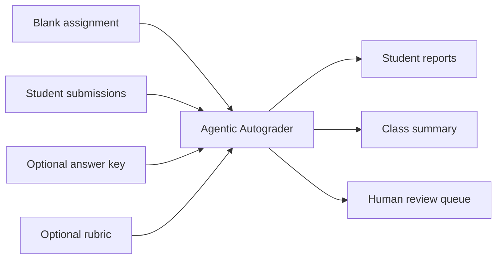
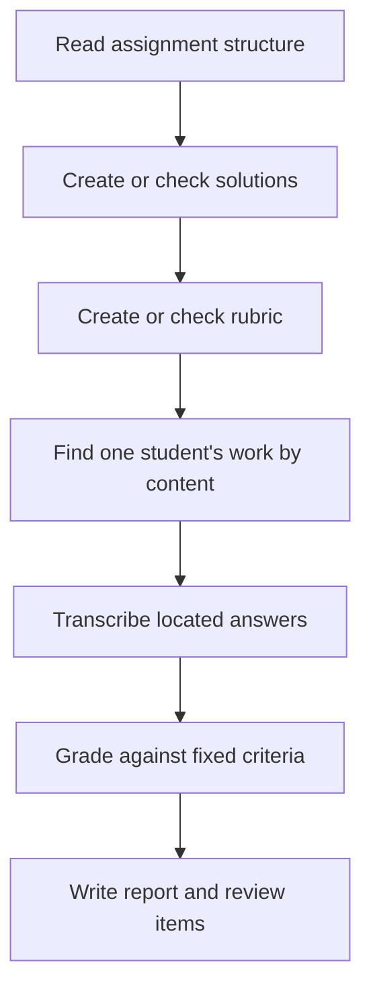

# Agentic Autograder

[](https://github.com/johnswyou/autograder/actions/workflows/tests.yml)


Agentic Autograder helps instructors grade handwritten physics and math work
without assuming every answer appears on the expected page. It finds each
student's work, transcribes what it can read, applies an explicit rubric, and
sends uncertain or incomplete results to a review queue before grades are
released.

> **This is an autonomous grader with required human oversight.** It produces
> grades automatically and sends uncertain, incomplete, or failed results to a
> review queue. Before releasing grades, instructors must review every queued
> item, inspect a sample of results that were not sent to the queue, and approve
> the final grades.

[What it does](#what-it-does) ·
[Real student work](#how-it-handles-real-student-work) ·
[Quick start](#quick-start) ·
[What to review](#what-to-review) ·
[Inputs](#supported-inputs) ·
[Results](#generated-results) ·
[Contributing](#for-contributors)

## What it does

Give the program a blank assignment and one or more student submissions. An
answer key and rubric are optional.



The program:

1. reads the assignment and lists every problem and subproblem;
2. generates or checks worked solutions;
3. generates or checks a point-based rubric;
4. searches each submission for the relevant work;
5. transcribes and grades each located answer; and
6. writes reports, a class summary, and a focused review queue.

If no answer key is supplied, separate solver and evaluator agents create and
check the solutions. A supplied key is checked for coverage and non-empty
content, but its mathematics is trusted unless
`--verify-provided-solutions` requests independent correctness verification.
Every dependent solution is verified only when its own check succeeds and all
of its prerequisite solutions are verified. Unverified prerequisite drafts are
advisory only, and every grade that depends on one is sent to human review.

## How it handles real student work

Student submissions rarely line up perfectly with the blank assignment. Pages
may be inserted or reordered, work may continue in a margin or on an extra
sheet, and a student may copy the wrong problem number. The program searches by
problem content instead of assuming that page numbers match.

When handwriting is too small to read in a full-page view, an agent can request
a cropped, higher-resolution view of the relevant region. It can also rotate a
page, inspect other pages, and read an embedded PDF text layer when one exists.
Zoom can enlarge detail that is present in the source, but it cannot restore
detail missing from a blurry or low-resolution scan.

Transcribers are instructed to preserve mistakes and crossed-out work. When
characters remain unreadable, they use `[illegible]` rather than inventing an
answer. Low-confidence transcriptions and work that may be unreadable are sent
to human review.

An explicit clean `blank` mapping, with no work regions, receives an automatic
zero. A `blank` or `not_found` mapping that also carries a work region still
receives that zero, but always enters human review so a person can confirm the
region really is empty: reporting "no work" while pointing at the answer space
describes where the mapper looked rather than contradicting its verdict.
Mapper or transcript integrity signals always enter human review,
including on an automatic-zero path.



## Quick start

### Install

You need Python 3.10 or newer and an Anthropic API key.

```bash
python -m venv .venv
source .venv/bin/activate
python -m pip install -e .
export ANTHROPIC_API_KEY="..."
```

On Windows PowerShell, activate the environment with:

```powershell
.venv\Scripts\Activate.ps1
```

You may pass the key with `--api-key` instead. The program never writes the API
key to the output directory.

> Model calls incur Anthropic API charges. Assignment pages and student
> submissions are sent to the API whenever a stage needs the model. Confirm
> that your institution's privacy and data-handling policies permit this use.

### Try the included example

The repository includes a synthetic, typeset assignment and submission. The
example contains an inserted blank page, continued work, an omitted answer, and
a mislabeled answer. It demonstrates document ingestion and answer matching; it
does not measure handwriting or OCR accuracy.

```bash
python examples/generate_sample.py

autograder grade \
    --assignment examples/sample/sample_assignment.pdf \
    --submissions examples/sample/submissions \
    --out runs/demo
```

Start with:

- `runs/demo/summary.csv` for class totals;
- `runs/demo/review_queue.md` for items needing attention; and
- `runs/demo/students/jordan_lee/report.md` for the student's detailed report.

### Grade your own assignment

First, inspect how the program understood the blank assignment:

```bash
autograder inspect \
    --assignment path/to/assignment.pdf \
    --out runs/assignment-name
```

Open `runs/assignment-name/assignment_spec.json` and confirm that the problems,
subproblems, and printed point values are correct. Then use the same assignment
and output directory for grading:

```bash
autograder grade \
    --assignment path/to/assignment.pdf \
    --submissions path/to/submissions/ \
    --out runs/assignment-name
```

The second command can reuse the assignment work completed by `inspect`. For
every command and option, see the
[usage guide](https://github.com/johnswyou/autograder/blob/main/docs/usage.md).

## What to review

The program adds items to `review_queue.md` for situations including:

| Situation | Result |
|---|---|
| The grader's confidence is below `--review-confidence` | Review the score and reasoning. |
| Transcription confidence is below `--ocr-threshold` | Compare the transcript with the original page. |
| Located work may be unreadable | Review it even if later stages produced a score. |
| The solution used for a problem is marked unverified | Review every grade that depends on that solution. Problems scored zero for `blank` or `not_found` are exempt: no solution is consulted to award zero. |
| A `blank` or `not_found` mapping carries work regions | It is a mapping failure, not a zero; no score is assigned and the item is reviewed. |
| No answer was found (`not_found`) | A provisional zero is recorded and always reviewed so a person can confirm that no work was missed. |
| One problem cannot be mapped, transcribed, or graded | No score is assigned for that problem; the report shows a processed subtotal but no final total. |
| An entire student fails before a report is completed | `summary.csv` contains a `failed` row with blank scores, and the review queue records the failure. |
| Student work contains instruction-like text | The text is treated as student data, recorded as an integrity concern, and reviewed. |

Confidence values are model self-assessments. They are not measurements of scan
quality and do not guarantee that a transcription or grade is correct.

Student-written text is treated as untrusted data. Agents are told to ignore
instructions embedded in a submission, record them as integrity concerns, and
continue grading. Recorded concerns cause the related grade to enter the review
queue, including when a clean blank would otherwise receive an automatic zero.

Agents can call a built-in arithmetic tool to check calculations. The tool
accepts only numeric expressions and approved math functions; it cannot run
commands or access files. Every generated Markdown output, including the
solutions manual and rubric, treats assignment, student, and agent text as
inert data, so a student's `<script>` tag is shown as text rather than
interpreted by the report viewer. Text-valued CSV cells are formula-neutralized
before spreadsheet import; numeric score cells remain numeric. Rare control
characters in student work are written as visible text in both CSV and Markdown
output — a NUL appears as `\x00` — so a generated file always opens as text
rather than being taken for a binary file.

## Supported inputs

| Input | Accepted forms | Notes |
|---|---|---|
| Blank assignment | PDF, PNG, JPEG, Markdown, or LaTeX | Supply one blank copy containing the prompts and printed point values. |
| Student submissions | PDF, PNG, JPEG, Markdown, or LaTeX | Supply files, a directory of files, or a directory with one subdirectory per student. |
| Answer key | Any accepted document form or structured JSON | Optional. Supplied entries are checked for coverage and non-empty content. |
| Rubric | Any accepted document form or rubric JSON | Optional. Every rubric problem weight must agree with the assignment's printed problem and total values; a conflict stops the command. Criterion sums may be rescaled after the weights are accepted. A rubric becomes **required** when the assignment prints some point values but not enough to weight every lowest-level problem — see the [usage guide](https://github.com/johnswyou/autograder/blob/main/docs/usage.md#where-problem-weights-come-from). |

A student may submit several PDFs and photos. The program combines them in
natural filename order. A Markdown or LaTeX submission must stand alone and
cannot be mixed with visual files.

Raster source images are accepted only up to 40,000,000 pixels. The program
reads that size from the image header and rejects an oversized file before
EXIF handling or full decode, so resize large photos before grading. This is
separate from the 3,400,000-pixel limit for each rendered page or crop shown
to an agent.

Student IDs come from filenames or directory names, not from names written on
the page. If two names reduce to the same safe directory name, the later one
receives a numeric suffix such as `_2`.

## Generated results

Files inside `--out` include generated reports and working records. Keep `--out`
separate from the assignment, answer key, rubric, and submissions: it cannot
equal, contain, or be inside any source path. In particular, do not place it
inside a submissions directory.

**An output directory holds student data.** Student names appear in directory
names and inside reports, and transcribed handwriting is stored alongside them.
`run_manifest.json` also records the path of every input file as it was given to
the command. Protect an output directory the same way you protect the original
submissions: keep it out of public repositories, shared drives, and issue
reports. The `.gitignore` in this repository excludes `GRADING/` and
`examples/sample/` so that grading work kept beside a checkout is never
committed by accident.

**What gets reused.** When a job resumes, the autograder may reuse saved work
instead of repeating it. Reusable records are the assignment structure
(`assignment_spec.json`), solutions (`solutions_manual.json`), rubric
(`rubric.json`), and each student's mapping (`mapping.json`), transcripts
(`transcripts.json`), and grades (`grades.json`).

**Do not edit generated files.** Treat files inside `--out` as read-only. Open
them to review a run, but do not edit them. If a saved record is invalid or
contains failed work eligible for retry, the autograder may rewrite that file. A
manual edit can therefore affect the resumed job or be lost.

**What a repaired solution invalidates.** Repairing a cached failed solution
also regenerates every dependent solution. When the manual changes, the program
rebuilds the rubric, grades, reports, summary, review queue, and manifest, while
retaining student mappings and transcripts.

Output directories written by an earlier release — identifiable by
`"schema_version": 1` in their `run_binding.json` — cannot be reused at all.
Start a new run in a fresh `--out` directory.

| File | What it tells you |
|---|---|
| `run_binding.json` | Stores fingerprints for the assignment, settings, teacher materials, and each student recorded so far. |
| `assignment_spec.json` | Lists the problems, subproblems, prompts, expected answer areas, and printed point values. |
| `solutions_manual.json` / `.md` | Shows worked solutions, their source, and whether generated answers were verified. |
| `rubric.json` / `.md` | Shows each scored criterion and its point value. |
| `students/<id>/mapping.json` | Shows where the program found each answer and how it classified the work. |
| `students/<id>/transcripts.json` | Shows the transcription and confidence for every lowest-level problem or subproblem, including empty or failed results. |
| `students/<id>/grades.json` | Stores criterion scores, evidence, confidence, and review reasons. |
| `students/<id>/report.md` | Presents one student's scores, feedback, flags, and transcripts in a readable report. |
| `summary.csv` | Collects class totals and per-problem scores. |
| `review_queue.md` | Lists student/problem pairs that require human attention and explains why. |
| `run_manifest.json` | Records the tool version, model, selected run configuration, input hashes, issues, and token use for the current command invocation. It never contains the API key. |

To change an answer key or rubric, edit a source file stored outside the output
directory, pass it with `--solutions` or `--rubric`, and choose a new output
directory.

## Control model use and cost

- `--model` (default `claude-sonnet-5`) selects the Anthropic model.
- `--effort` adjusts the model's reasoning effort.
- `--thinking off` disables adaptive thinking.
- `--max-workers` controls how many agents work in parallel within a stage.
- `--review-confidence` and `--ocr-threshold` change which results are sent to
  review; they do not change scores. Either one can be changed on an existing
  output directory: the review marks are recalculated from saved grades, so a
  re-run under a different threshold costs nothing.
- `--force` ignores saved results and rebuilds every stage the command requests.
  It does not accept changed inputs, and it discards a partly finished run — to
  resume after an interruption, repeat the command without it.
- Prompt caching lets Anthropic reuse repeated prompt content during multi-turn
  agent work. `--no-prompt-caching` disables it and can increase input-token
  cost.

Changing the model, reasoning settings, review thresholds, or teacher materials
means starting a new output directory. The
[usage guide](https://github.com/johnswyou/autograder/blob/main/docs/usage.md#start-a-new-job-after-changing-inputs-or-settings)
lists exactly which options are safe to vary between runs.

Assignment analysis, solutions, and rubric creation happen once per grading
job. Mapping happens once per student, while transcription and grading run for
each problem where work was located. For a large class, student processing
usually dominates time and cost.

`run_manifest.json` records API calls and token usage accumulated during the
current command invocation, including prompt-cache reads and writes. It does
not combine usage from earlier resumptions.

## For contributors

The source follows the same stages that users see:

| Area | Modules |
|---|---|
| Commands and coordination | `autograder/cli.py`, `autograder/orchestrator.py` |
| Structured data models | `autograder/models.py` |
| Document reading and agent tools | `autograder/ingest.py`, `autograder/tools.py` |
| Assignment-level work | `autograder/assignment.py`, `autograder/solutions.py`, `autograder/rubric.py` |
| Student-level work | `autograder/mapping.py`, `autograder/ocr.py`, `autograder/grading.py` |
| Model-agent loop | `autograder/llm.py` |
| Output consistency and reports | `autograder/run_state.py`, `autograder/report.py` |

Run the offline test suite:

```bash
python -m pip install -e . pytest
python -m pytest tests/ -q
```

The tests use synthetic documents and scripted model clients, so they do not
need an API key or network access.

Continuous integration also runs a linter and a type checker. A pull request
cannot merge while either one reports a finding, so run both before pushing:

```bash
python -m pip install -e . "ruff==0.16.0" "mypy==2.3.0"
ruff check autograder/ scripts/ tests/
mypy autograder/ scripts/
```

`ruff check --fix` applies the mechanical corrections. Three details are worth
knowing before the first run:

- The linter checks `autograder/`, `scripts/`, and `tests/`. The type checker
  reads `autograder/` and `scripts/` but not `tests/`, so type errors inside
  the test suite are not reported.
- Both tool versions are pinned. A new release of either one would otherwise
  introduce findings in a pull request that did not cause them, so raising a
  pin is a deliberate change rather than a side effect.
- The rules each tool enforces are written out in `pyproject.toml` instead of
  left at the tool's default, because those defaults change between releases.
  That file also records why two rule groups are switched off.

Read the
[architecture guide](https://github.com/johnswyou/autograder/blob/main/docs/architecture.md)
for module boundaries, stage coordination, data models, and extension points.
The
[usage guide](https://github.com/johnswyou/autograder/blob/main/docs/usage.md)
is the detailed operator reference.

## Limitations

- Grades remain model judgments. Before releasing them, review every queued item
  and inspect a sample of results that were not sent to the review queue.
- Zooming cannot recover detail that is absent from the source scan.
- The workflow and prompts target physics and mathematics. Other subjects may
  require different rules and validation.
- Student processing is sequential across students, though work within a stage
  can run in parallel. Large classes should account for API rate limits.
- The CLI does not include a viewer or gradebook integration; outputs are files
  for an instructor to inspect and transfer through an approved process.

## License

The project is licensed under the
[MIT License](https://github.com/johnswyou/autograder/blob/main/LICENSE).
Package metadata and dependencies are listed in
[pyproject.toml](https://github.com/johnswyou/autograder/blob/main/pyproject.toml).
PyMuPDF offers AGPL and commercial licensing options; confirm that the option
you use suits your deployment.
