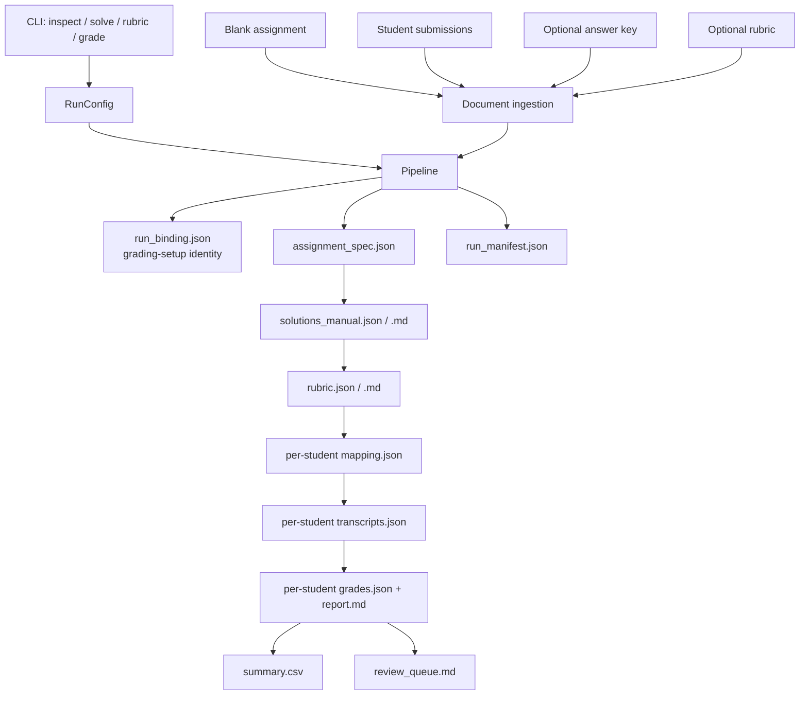
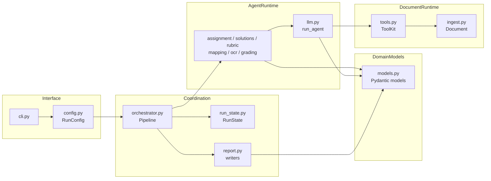
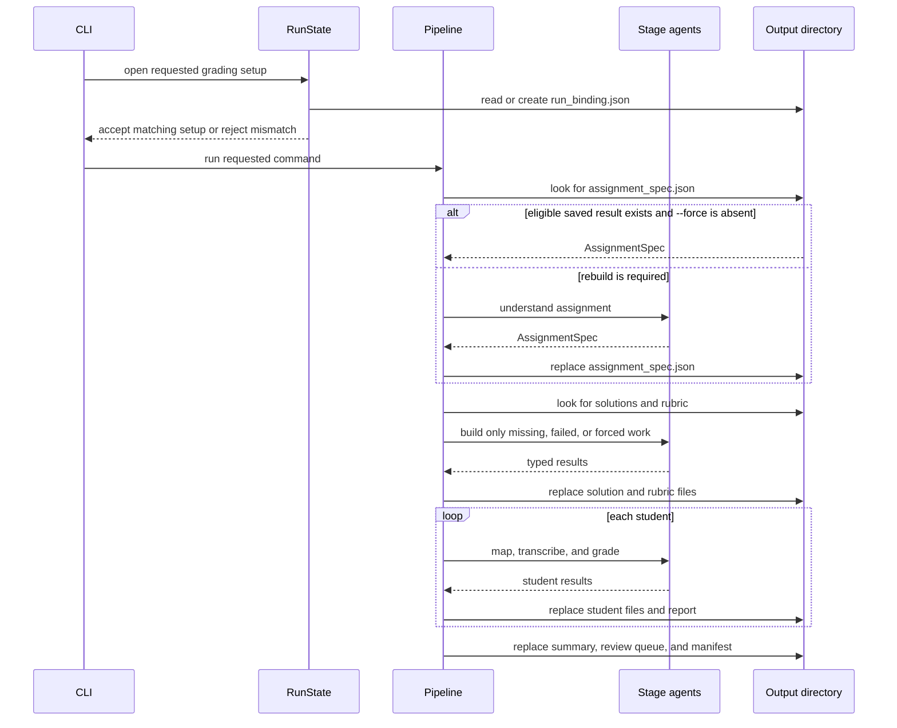
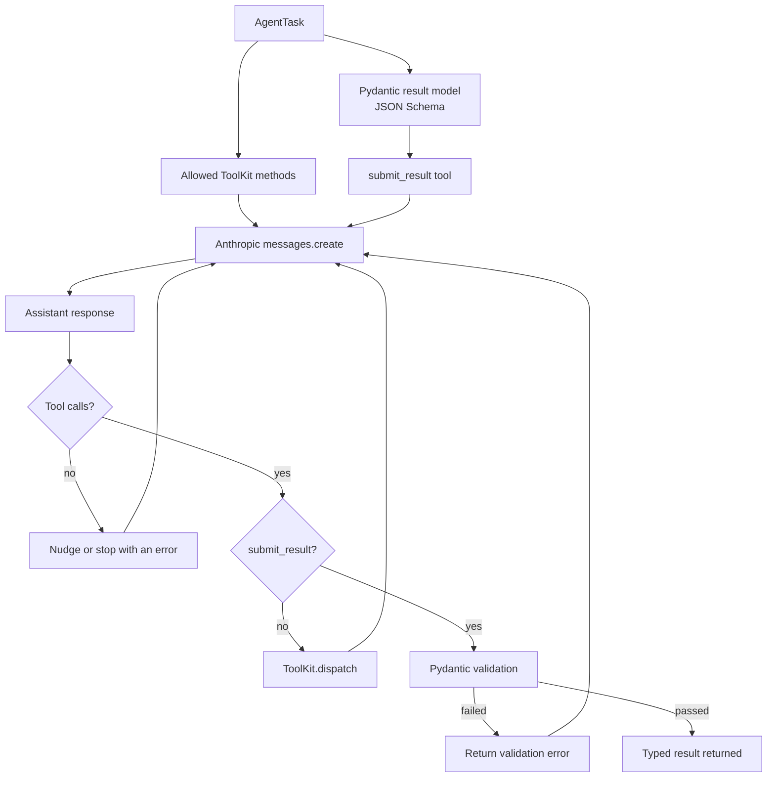
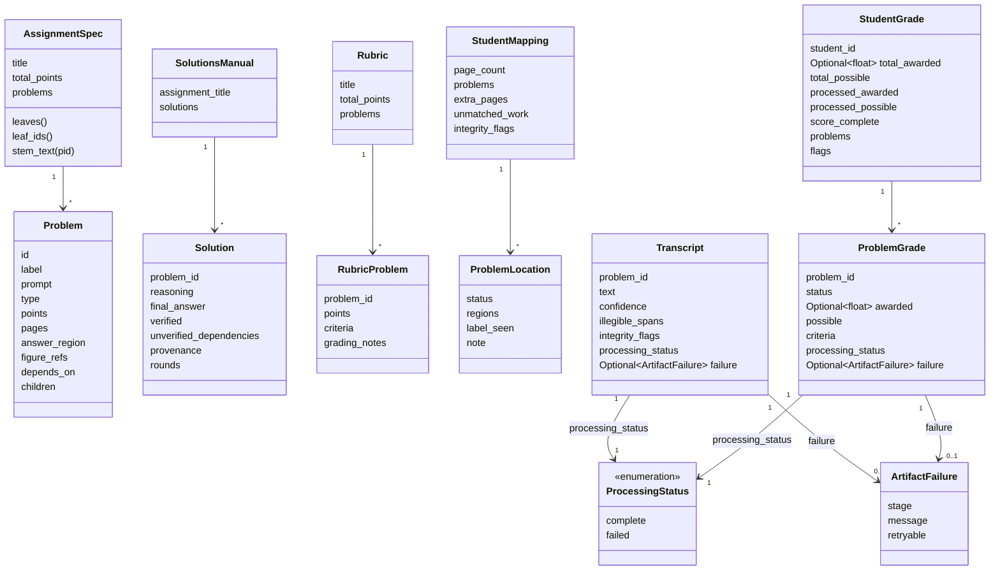

# Architecture

This guide describes how Agentic Autograder is organized, how data moves
between stages, and which guarantees contributors must preserve. It is written
for people changing the code or embedding the pipeline. Instructors looking
for commands and operating procedures should use the [usage guide](usage.md).

- [Architectural overview](#architectural-overview)
- [System layers](#system-layers)
- [Safe persistence and reuse](#safe-persistence-and-reuse)
- [Pipeline stages](#pipeline-stages)
- [Agent runtime](#agent-runtime)
- [Data model](#data-model)
- [Programmatic integration](#programmatic-integration)
- [Testing the architecture](#testing-the-architecture)
- [Design decisions](#design-decisions)

## Architectural overview

Agentic Autograder is a file-backed pipeline. Model agents interpret documents
and make domain judgments; typed Pydantic models define every stage boundary;
ordinary Python code enforces scoring, review, persistence, and recovery rules.

### Terms used in this guide

An **artifact** is a generated, structured file that one pipeline stage writes
for another stage to read. Examples include `assignment_spec.json`,
`mapping.json`, and `grades.json`.

A **gradable leaf** is the lowest-level problem or subproblem that receives its
own rubric entry and score. A parent problem that only groups parts is not a
gradable leaf.

A **grading setup** is the set of inputs and settings associated with one
output directory. In the implementation, `RunState` records that identity in
`run_binding.json`.

These terms distinguish three kinds of state:

- source inputs supplied by an instructor or student;
- typed Python objects exchanged while a command is running; and
- generated artifacts retained so later stages or repeated commands can use
  completed work.



## System layers

The repository separates command parsing, coordination, document access, model
work, domain schemas, and reporting. The dependency direction is intentional:
stage modules ask the shared runtime to perform model work, while the pipeline
coordinates stages and owns persistence.



### Command-line interface and configuration

`autograder/cli.py` defines `inspect`, `solve`, `rubric`, and `grade`. It parses
arguments, validates combinations that can be checked without model work,
constructs `RunConfig`, invokes the matching `Pipeline` method, and translates
completion or failure into a process exit code.

`autograder/config.py` owns operational defaults. `RunConfig` includes the
model, API key, worker count, token limits, thinking and effort choices, review
thresholds, prompt-caching choice, rendering limits, and `force`. Its
saved-result identity deliberately excludes secrets such as the API key while
including settings that can change generated results.

The four commands expose progressively larger portions of one pipeline:

| Command | Pipeline entry point | Last requested assignment-level stage |
|---|---|---|
| `inspect` | `Pipeline.run_inspect()` | Assignment structure |
| `solve` | `Pipeline.run_solve()` | Solutions |
| `rubric` | `Pipeline.run_rubric()` | Rubric |
| `grade` | `Pipeline.run_grade()` | Student reports and class outputs |

### Pipeline orchestration

`autograder/orchestrator.py` owns stage order and dependencies. Each
assignment-level `stage_*` method produces one typed result, and `_load_or`
either reads an eligible saved artifact or calls the function that rebuilds
it. `Pipeline` also coordinates per-student mapping, transcription, grading,
report writing, the review queue, and the final manifest.

The orchestrator does not decide whether an output directory belongs to the
requested grading setup. It delegates that check to `RunState` before reading
saved artifacts or creating a model client. This keeps input consistency and
recovery rules centralized.

The `run_state.py` output seam checks the assignment before opening the output
directory, optional teacher materials before binding them, raw submission paths
before discovery, and exact student files before processing. `--out` must be
disjoint from the assignment, answer key, rubric, and submissions: equal paths
and either ancestor/descendant relationship are rejected, while sibling paths
are valid.

### Document and agent tools

`autograder/ingest.py` converts PDFs, images, Markdown, and LaTeX into a
page-oriented `Document`. A submission may combine several PDFs and photos in
natural filename order. Downstream code uses page numbers, optional PDF text
layers, rendered images, and percentage-based rectangular regions rather than
format-specific APIs.

Page-backed operations use a per-document lock. Several agents can share a
document across threads, but rendering and text access are serialized because
the MuPDF embedder must provide safe locking.

Raster source dimensions are read from image headers. A source above
`max_source_pixels` (40,000,000 by default) is rejected before EXIF handling,
full decode, or RGB conversion. Before PyMuPDF allocates a page/crop pixmap or
Pillow resizes a raster page/crop, `ingest.py` bounds the scale so its
ceiling-rounded dimensions fit `max_pixels` (3,400,000 by default).
`_cap_pixels` remains a final post-allocation invariant; it is not the primary
allocation guard. Operators should resize oversized source photos before
grading.

`autograder/tools.py` exposes four tools to model agents:

| Tool | Responsibility |
|---|---|
| `view_page` | Render a full page at normal or high detail, optionally rotated. |
| `zoom` | Render a cropped region at higher effective resolution. |
| `read_text` | Read an embedded text layer for exact typeset content. |
| `compute` | Evaluate restricted arithmetic without allowing arbitrary code. |

Regions use percentages so coordinates remain stable across rendering sizes.
Small rounding slop outside 0-100 is clamped, but a coordinate far outside that
range means the agent measured in another unit, usually pixels; the region is
rejected so the schema-repair loop returns the error and the agent can restate
it. Clamping such a value instead would yield a zero-width sliver that renders
blank while still looking like a valid location. Raster crops may be enlarged up
to `max_upscale`, but every rendered image must remain below `max_pixels`.

The arithmetic evaluator accepts a small AST allowlist. It rejects names,
attributes, imports, and other code, and it caps expensive operations and large
intermediate integers.

### Stage-specific agents

The domain modules own prompts and stage rules:

| Module | Responsibility |
|---|---|
| `assignment.py` | Build and normalize the assignment structure. |
| `solutions.py` | Parse a supplied key or generate and evaluate solutions. |
| `rubric.py` | Parse, generate, and normalize scoring criteria. |
| `mapping.py` | Locate each gradable leaf in a submission by content. |
| `ocr.py` | Transcribe located work without correcting student mistakes. |
| `grading.py` | Apply fixed rubric criteria and finalize review decisions. |

These modules prepare `AgentTask` values and interpret typed results. They do
not implement separate API loops; all model interaction runs through
`autograder/llm.py`.

Student-facing agents treat submission contents as untrusted data. Mapping,
transcription, and grading prompts tell the model to ignore instruction-like
text in a submission, record it as an integrity concern, and continue the
assigned task.

### Reports and structured models

`autograder/models.py` contains the Pydantic models shared by prompts,
orchestration, persistence, and report generation. Stage results are validated
before the pipeline can use or save them.

`autograder/report.py` owns the shared Markdown and CSV output encoders and
renders student and class reports. `autograder/solutions.py` and
`autograder/rubric.py` reuse its Markdown encoder for the solutions manual and
rubric. Every generated Markdown artifact renders assignment, student, and
agent text as inert data; text-valued CSV cells are formula-neutralized before
spreadsheet import. Numeric CSV score fields remain numeric. Both encoders
rewrite NUL as a visible `\x00`: `csv.writer` rejects the raw character on
Python 3.10, and a single raw NUL makes a Markdown report read as a binary file.

`run_manifest.json` is the command audit record. It includes the tool version,
timestamps, model, selected run configuration, input hashes, recorded issues,
and token usage accumulated during the current command invocation. The API key
is excluded.

## Safe persistence and reuse

Persistence is part of the pipeline contract, not a command-line convenience.
Before considering saved work, `RunState` verifies the assignment and settings,
compares the digest of every requested input whose name was recorded earlier,
and records digests for new input names.

Before each matching bind, discovery, or stage can examine an input, the
pipeline rejects an output path that equals, contains, or is contained by an
assignment, answer key, rubric, raw submission path, or discovered submission
file. The assignment check occurs before the output directory is created. This
prevents generated artifacts from being mistaken for source input.

### Checking that inputs still match

Before the pipeline reads any saved artifact or creates a model client,
`RunState` compares the requested setup with `run_binding.json`. A mismatch in
any recorded value is an error, not a warning, because combining results from
different assignments, teacher materials, student files, or model settings
could silently corrupt grades.

The schema-version-2 file records:

- the assignment SHA-256;
- the identity of `RunConfig` settings that affect generated results, which is
  exactly what `RunConfig.cache_identity()` returns;
- each supplied answer key and rubric SHA-256, or `generated` when omitted;
- a digest of `--rubric-prompt`, or `none` when omitted; and
- one order-sensitive `submission:<slug>` digest for each student's files.

`cache_identity()` deliberately excludes both secrets (the API key) and
execution-only choices that cannot change an artifact's contents: `max_workers`,
`prompt_caching`, `verbose`, and `force`. Excluding `force` is what lets
`--force` rebuild an existing directory; treating it as part of the identity
would reject the flag in the one situation it exists for.

The two review thresholds, `review_confidence` and `ocr_review_threshold`, are
excluded for a different reason. They do change what a saved grade says, but
only its `needs_review` mark, and that mark is recomputed on every read by
`grading.apply_review_thresholds()`. A `ProblemGrade` stores the review reasons
that describe the work in `intrinsic_review_reasons`; the two confidence
comparisons are re-derived from the current settings and appended to those.
Keeping the thresholds out of the identity is therefore safe, and it lets an
operator re-read a finished run at a different threshold for free.

A mismatch names the settings that differ, so a deliberate model change is
distinguishable from an accidentally carried-over one. A setting present in a
saved binding but absent from the current identity is reported as belonging to
an earlier release rather than as a value the operator requested.

`RunState` does not store or compare one digest for the complete submission
roster. An unseen student name is added to the file; a student absent from a
later invocation is not noticed. Consequently, adding or removing a student can
rewrite class-level outputs while leaving an old per-student directory behind.
Callers must choose a new output directory whenever roster membership changes.

Changing any recorded value requires a new `--out` path. A nonempty directory
without a valid supported file is also rejected; the program does not migrate
older output layouts. Directories whose `run_binding.json` carries
`"schema_version": 1` — the binding file's own format version, not a release
number — are rejected because they can contain solution dependencies and grades
built under the earlier trust semantics; use a fresh `--out` path.

`run_binding.json` verifies the assignment, settings, and values saved under
previously recorded input names; it does not verify the complete submission
roster or the contents of generated files. Without `--force`, `_load_or` reads a
saved JSON file when it passes Pydantic validation. A valid manual JSON edit can
therefore affect a later command, while an invalid or inconsistent edit may be
normalized, rejected, or overwritten. Generated files should be treated as
pipeline-owned resume data, not as teacher-authored source material.

### Reusing or rebuilding saved results

An output directory created without `--force` can reuse completed stages when
their recorded inputs and settings remain compatible. The command name is not
part of the binding, so a later command can extend a compatible run—for
example, `grade` can reuse assignment work written by `inspect`. `_load_or`
reads an existing stage artifact instead of making the corresponding model
calls. If all requested artifacts are complete, the command needs no API key.

`--force` bypasses saved results for every stage the command requests. It is a
per-invocation switch rather than a property of the directory: it can be added
to a directory built without it and dropped again afterwards. It does not relax
any binding check, so rebuilding never becomes a way to adopt a changed
assignment, teacher material, or setting.

Per-problem failures do not discard successful siblings. A failed generated
solution, transcript, or grade is stored as an unavailable result. The next
identical run without `--force` retries failed transcript and grade entries
while retaining successful siblings. Repairing a failed generated solution
also regenerates every transitive dependent solution. If the replacement
manual differs, the pipeline removes the rubric, grades, reports, summary,
review queue, and manifest before publishing it; mappings and transcripts are
retained. If no API key is available, the unavailable result remains and the
manifest records the reason.

If an entire student fails, grading continues for other students. Before the
CLI exits with status `2`, the pipeline writes all available reports,
`summary.csv`, `review_queue.md`, and `run_manifest.json`. Student reports show
a processed subtotal when work is incomplete, while final totals remain
unavailable.



### Atomic file replacement and single-process ownership

Every JSON, Markdown, CSV, setup, and manifest file uses the same replacement
protocol:

1. create a sibling temporary file;
2. write and `fsync` that temporary file; and
3. atomically replace the destination path.

This protects one destination from a torn write. It does not make an entire
output directory transactional. The implementation does not provide directory
`fsync`, locks between processes, concurrent-writer safety, or transactional
recovery. Exactly one process must own an output directory.

## Pipeline stages

The assignment-level stages establish a common problem structure, solutions,
and rubric. Student-level stages then locate, transcribe, and grade work against
that shared structure.

### Read the assignment

`assignment.py` reads the blank assignment and produces `AssignmentSpec`: a
tree of problems, parts, subparts, printed points, expected answer regions,
figure regions, dependencies, and answer formats.

Stable problem IDs such as `1`, `1a`, and `1a.ii` connect every later artifact.
Only gradable leaves receive solution, rubric, mapping, transcript, and grade
records; parent nodes preserve hierarchy and shared prompt text.

The stage normalizes IDs and point information before later agents run. Printed
points take precedence. If the assignment has neither printed problem values
nor a printed total, each gradable leaf receives one point. If a printed total
does not determine every weight, rubric construction requires a complete
instructor rubric rather than guessing an equal split.

### Establish solutions

`solutions.py` either parses an instructor-provided answer key or generates a
manual.

A provided document is matched to assignment problems by content and checked
for coverage and nonempty answers. This does not independently prove the
mathematics. `--verify-provided-solutions` opts supplied entries into the
evaluator step. Missing entries are generated with the same solver/evaluator
process unless `--strict-solutions` requests an error. A generated answer that
still fails evaluation remains unverified and sends dependent grades to
review. A dependent solution is verified only when its own evaluator or
trusted-source check succeeds and every prerequisite solution is verified.
Unverified prerequisite drafts are shown to agents as advisory material, not
official results, and they force dependent grades into review.

`Solution.verified` is provenance-sensitive: generated answers require
evaluator success, while supplied answers normally require successful problem
matching. In both cases, a dependent solution is verified only when every
prerequisite solution is verified. With `--verify-provided-solutions`, a
negative evaluator verdict clears the status; an evaluator infrastructure
failure records an issue and preserves the prior matching status.

An infrastructure failure does not change the supplied entry's saved status,
so dependent grades are not queued for this reason. The manual has no separate
status for “check unavailable,” and loading it does not retry the requested
check. The CLI calls out a failure observed during the current invocation. A
caller that needs the independent check must either review the answer manually
or resolve the failure and build the manual in a new output directory.

For generated work, one solver creates a solution and a separate evaluator
re-derives and checks it. Failed checks can trigger regeneration. The
`solution_max_rounds` configuration field allows up to 2 regeneration attempts
after the initial solver/evaluator attempt (3 total attempts by default).
Dependencies are arranged in topological levels, so a problem that says “use
your answer from part (a)” receives verified prerequisite results as official
context and unverified drafts only as advisory context. The manual records the
sorted prerequisite IDs that make a dependent solution effectively unverified.

### Build the rubric

`rubric.py` parses a provided rubric or generates criteria from the assignment
and solutions. `--rubric-prompt` adds instructor preferences while criteria are
being generated.

Code enforces the point contract after model work:

- every gradable leaf has a rubric entry;
- criteria for an accepted problem weight sum to its available points;
- criteria that do not sum are rescaled proportionally;
- an empty criteria list becomes one full-credit criterion;
- generated entries filling gaps are marked; and
- the rubric total is recomputed from the accepted problem weights.

A supplied problem weight that conflicts with an explicit gradable-leaf value,
parent total, or assignment total raises `PointAllocationError` instead of
being normalized. When printed values do not determine each leaf's weight, a
complete rubric must provide weights whose sums satisfy every printed total.

`--strict-rubric` requests an error instead of filling a missing entry.

### Locate and transcribe student work

`mapping.py` compares the known assignment content with a student's entire
submission. It does not assume that work appears on the same page as the blank
assignment. This handles skipped parts, inserted or appended pages, continued
work, and incorrect written labels.

Each `ProblemLocation` records a status and, when work is present, page regions
in reading order. An explicit clean `blank` has no work regions and receives a
deterministic zero. A `blank` or `not_found` status that also carries a work
region still receives that zero — reporting no work while pointing at the answer
space describes where the mapper looked rather than contradicting the verdict —
but always enters human review so a person confirms the region is empty. A clean
`not_found` result also receives a provisional zero but always enters human
review because the absence-of-work judgment may be wrong. An omitted record or a
claim of work with no usable location becomes `mapping_error`; the score is
unavailable rather than zero.

`ocr.py` runs a fresh transcriber for each mapped gradable leaf. The transcriber
receives the mapped regions, can inspect or enlarge relevant pages, and returns
verbatim student work, a confidence value, unreadable-span count, quality
notes, and integrity concerns. It is instructed to preserve mistakes and use
`[illegible]` instead of inventing characters.

Mapping regions and transcript crops use the same page-coordinate frame.
Rotation-aware crop tests protect this boundary so that a mapper's rectangle
continues to identify the intended work when the transcriber requests another
view.

### Grade and report

`grading.py` grades one student and gradable leaf at a time. The agent receives
the fixed rubric entry, official solution, transcript, mapping status, and
image context for the student's work.

Deterministic finalization then:

- clamps every criterion award to its valid range;
- fills omitted criteria with zero and records a review reason;
- recomputes problem and student totals;
- preserves unavailable processing results instead of converting them to zero;
  and
- forces human review for low grader confidence, low transcript confidence,
  unverified solutions, doubtful readability, mapper or transcript integrity
  signals (including deterministic-zero grades), `not_found`, `mapping_error`,
  and processing failures.

`report.py` writes the student report, class summary, and review queue from the
finalized models. The pipeline never substitutes a processed subtotal for an
incomplete final grade.

## Agent runtime

Stage modules define agent purpose and context, but `llm.py` owns one reusable
model interaction loop. An `AgentTask` specifies the agent name, system prompt,
initial content, Pydantic result model, optional `ToolKit`, allowed tools, token
limit, and context label.

### Structured result submission and repair

Every task receives a required `submit_result` tool whose JSON schema comes
from its Pydantic result model. A model response does not become a stage result
until it calls that tool and validation succeeds.

When validation fails, the runtime returns the specific error as a tool result
and lets the agent repair its data. When an agent stops without submitting, the
runtime nudges it up to two times. Turn limits and API retry handling bound the
overall loop.



### Prompt caching and image eviction

The runtime adds prompt-cache breakpoints after the tool/system prefix and on
the most recent user block. As a multi-turn conversation grows, prior content
can be read from Anthropic's prompt cache rather than billed as entirely new
input on each turn. `--no-prompt-caching` disables those breakpoints.

Tool calls can add many images to a conversation, and every later request would
otherwise resend all of them. The `max_tool_images` configuration field
controls how many tool-result images one agent retains (20 by default). When
the conversation exceeds that limit, the runtime replaces the oldest results
with a text placeholder. Initial page context is retained, and the agent can
request an evicted view again.

Thinking mode, effort, token limits, usage accounting, schema repair, tool
dispatch, and image replacement are centralized here so stage modules do not
develop incompatible API behavior.

## Data model

The core Pydantic models serve both as in-process types and as the schemas for
JSON artifacts. Relationships that matter across the pipeline are shown below.



`AssignmentSpec` is the root of the domain graph. `SolutionsManual` and
`Rubric` must cover its gradable leaves. A `StudentMapping` connects those IDs
to one submission, `Transcript` records the observed student work, and
`StudentGrade` contains finalized scores and review state.

`ProcessingStatus` and `ArtifactFailure` distinguish “the student earned zero”
from “the system could not produce a score.” That distinction propagates into
reports, summary fields, retries, and the process exit status.

## Programmatic integration

The CLI is a wrapper around `autograder.orchestrator.Pipeline`. An application
can construct the same configuration and call a command-level entry point
directly. Call exactly one public `run_*` method on a `Pipeline` instance. Every
`run_*` method releases the assignment document on the way out, including when it
raises, so callers do not have to close it themselves. `Pipeline.close()` is
public and idempotent if a caller wants to be explicit.

```python
import os
from pathlib import Path

from autograder.config import RunConfig
from autograder.orchestrator import PartialGradeFailure, Pipeline

config = RunConfig(
    model="claude-sonnet-5",
    api_key=os.environ.get("ANTHROPIC_API_KEY"),
    max_workers=4,
    thinking="on",
    review_confidence=0.6,
    ocr_review_threshold=0.5,
)

pipeline = Pipeline(
    config,
    assignment_path=Path("hw3.pdf"),
    out_dir=Path("runs/hw3"),
)

failures = []
try:
    grades = pipeline.run_grade(
        submission_paths=[Path("submissions/")],
        solutions_path=None,
        rubric_path=None,
        steer=None,
    )
except PartialGradeFailure as exc:
    grades = exc.grades
    failures = exc.failures
```

On complete runs, each public method returns typed Pydantic models and writes
the same artifacts used by the corresponding CLI command. `run_grade` writes
all available class outputs and then raises `PartialGradeFailure` when a student
failed or any final score is incomplete. Its `grades` and `failures` attributes
expose those available results, as the example shows.

Every entry point applies the same grading-setup checks and persistence rules;
embedding the pipeline does not bypass output-directory safety. Create a fresh
`Pipeline` instance before calling another command-level method.

### Advanced `RunConfig` values

The following fields are not exposed directly as command options. Programmatic
callers may override them when constructing `RunConfig`.

| Field | Default | Meaning |
|---|---|---|
| `max_agent_turns` | `480` | Maximum turns before one agent is stopped. |
| `max_tokens` / `big_max_tokens` | `32768` | Standard and large-payload output-token limits. `--max-tokens` raises both in the CLI. |
| `max_tool_images` | `20` | Tool-result images retained before the oldest are replaced; initial page context remains. |
| `solution_max_rounds` | `2` | Solver/evaluator regeneration rounds before a solution remains unverified. |
| `inline_page_cap` | `12` | Pages included directly in an agent's initial message. |
| `inline_page_edge` | `1100` | Long-edge pixels for a normal page view. |
| `detail_page_edge` | `1568` | Long-edge pixels for a high-detail page view. |
| `zoom_target_edge` | `1500` | Target long-edge pixels for a cropped view. |
| `max_upscale` | `4.0` | Maximum enlargement factor for raster crops. |
| `max_source_pixels` | `40_000_000` | Maximum accepted raster source pixels, checked from the header before full decode. |
| `max_pixels` | `3_400_000` | Maximum rendered pixels in one image. |

## Testing the architecture

The offline test suite uses synthetic documents and scripted model clients, so
it needs no API key or network access. Tests are grouped by boundary:
document ingestion and tools, the agent loop, pipeline rules, failure/resume
behavior, output-directory consistency, generated reports, CLI behavior, and
documentation contracts.

```bash
python -m pip install -e . pytest
python -m pytest tests/ -q
```

When changing a boundary, test both its local rule and the handoff to the next
layer. Examples include region coordinates from mapping to transcription,
unavailable scores from grading to reports, and configuration identity from
`RunConfig` to `RunState`.

The end-to-end tests use scripted clients instead of weakening production
validation. A test response must satisfy the same Pydantic schema, repair loop,
score finalization, and persistence behavior as a real model response.

## Design decisions

### Stable problem identifiers instead of page assumptions

The blank assignment is converted once into an `AssignmentSpec` with stable
gradable-leaf IDs. Every later stage uses those IDs. Student work is located by
content, so an inserted page, appended sheet, continued answer, or incorrect
written label does not shift the meaning of every later page.

This adds an explicit mapping stage, but it prevents page position from becoming
a hidden cross-stage dependency.

### Model judgment followed by deterministic rules

Models interpret layout, solve problems, transcribe handwriting, and apply
rubric criteria. Code then enforces rules that should not vary by model
judgment: valid IDs and regions, point totals, criterion bounds, blank and
no-work handling, unavailable processing results, final totals, and mandatory
review triggers.

This split makes model uncertainty visible without letting it redefine the
grading contract.

### Inspectable generated files

Artifacts are plain JSON, Markdown, and CSV so instructors can inspect them and
contributors can reproduce stage behavior. `run_binding.json` rejects changes
to values it has already recorded; it does not detect removal of a student from
the roster. `run_manifest.json` records the tool version, selected run
configuration, input hashes, issues, and usage for the current command
invocation.

Some JSON artifacts are also resume inputs. A matching `run_binding.json`
protects recorded external-input values and settings; as described above, it
does not record the complete roster or hash generated files. Contributors must
not assume that a matching file also proves roster identity or artifact
integrity.

Manual edits are unsupported because their treatment depends on the stage and
content: a later command may reuse, normalize, reject, or overwrite them. An
instructor should supply revised material as a source file through
`--solutions` or `--rubric` and start a new output directory. That workflow
keeps accepted teacher inputs explicit and reviewable.
