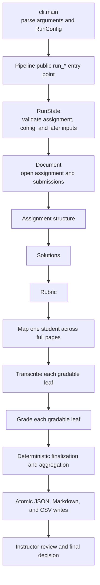
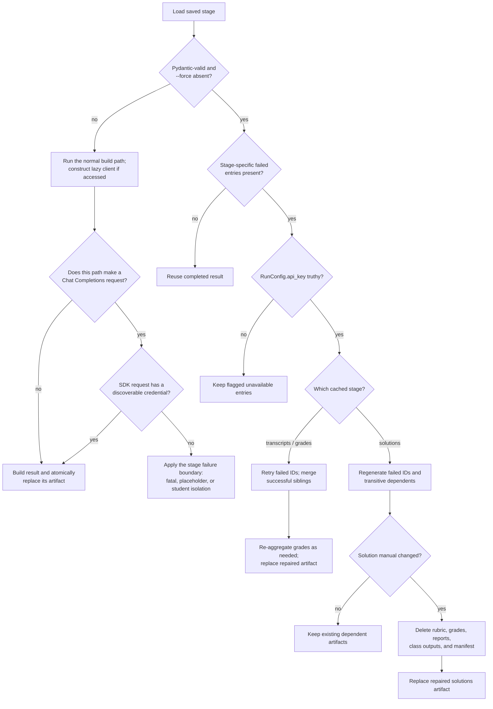

# Architecture

This is the contributor guide to the runtime: where execution enters, how a
page becomes model-visible content, which module owns each judgment, and which
guarantees ordinary Python enforces after model work. For the instructor's
workflow, use [Usage](usage.md). For exact options, defaults, input layouts,
artifact fields, and statuses, use [Reference](reference.md). For a shorter
reader-level explanation, use [How it works](how-it-works.md).

## Start at the real entry point

`autograder` enters [`cli.main`](../autograder/cli.py). The CLI parser checks
syntax and local option ranges, `_to_config` constructs a `RunConfig` and reads
`OPENROUTER_API_KEY`, and `main` constructs one `Pipeline`. It then calls exactly
one command-level entry point:

| CLI command | Public call | Last stage requested |
|---|---|---|
| `inspect` | `Pipeline.run_inspect()` | Assignment structure |
| `solve` | `Pipeline.run_solve(...)` | Solutions manual |
| `rubric` | `Pipeline.run_rubric(...)` | Rubric |
| `grade` | `Pipeline.run_grade(...)` | Student and class reports |

The command matrix and argument defaults live in
[Reference](reference.md#command-syntax), not here.

`Pipeline.__init__` performs the first important boundary checks before any
model client exists. It rejects overlap between the assignment and output,
hashes the assignment, opens or creates `run_binding.json` through `RunState`,
and opens the assignment as a page-oriented `Document`. The OpenRouter client is
lazy: a fully reusable call path never evaluates `Pipeline.client` and therefore
does not need an API key. Every public `run_*` method closes the assignment in a
`finally` block. `Pipeline.close()` is also public and idempotent.



Assignment-level work runs once along the requested path. During `grade`,
students run sequentially; independent problem tasks within a student run in
worker pools. This avoids multiplying student documents and worker pools at the
same time while still parallelizing the expensive per-problem calls.

## Follow one visual answer from bytes to a grade

The visual path is concrete. A PDF is not sent to OpenRouter as a filename, and
there is no separate OCR service hidden behind the pipeline.


### 1. `Document` turns sources into pages

[`ingest.py`](../autograder/ingest.py) accepts PDFs, raster images, and a single
Markdown or LaTeX source. A multi-file visual submission is naturally sorted
and its PDF pages and photos are concatenated into one 1-based page sequence.
Text sources are divided into character-bounded chunks and use text content
instead of the image path.

For a PDF, `Document.render_page` asks PyMuPDF for a pixmap at a scale bounded
*before allocation*, converts that pixmap to a Pillow RGB image, applies any
requested clockwise view rotation, enforces a final pixel cap, and calls
`_encode_jpeg`. `render_region` converts a percentage rectangle into a PDF clip
and re-renders that clip at higher effective resolution. For a photo, the same
methods resize the decoded RGB image or crop its existing pixels, with a
separate upscale limit for crops. Rotation-aware coordinate conversion maps a
box measured in a rotated view back to the original page before cropping.

`_encode_jpeg` tries successively lower JPEG qualities against its byte target
and, as a final fallback, shrinks once and encodes again. `render_page` and
`render_region` therefore return JPEG `bytes`, not Pillow or PyMuPDF objects.
The configured source-pixel guard is checked from raster headers before EXIF
transpose, full conversion, or later rendering. Page-backed access is protected
by a per-document reentrant lock because transcribers and graders share a
`Document` across threads and PyMuPDF does not supply embedding locks.

### 2. JPEG bytes become OpenRouter image content

[`tools.image_block`](../autograder/tools.py) uses standard base64 encoding and
returns this request shape:

`type=image_url` and an `image_url.url` beginning
`data:image/jpeg;base64,`.

`inline_pages` places up to the configured initial-page cap into the first user
message and adds a notice telling the model to fetch later pages. `ToolKit`
exposes four shared tools:

| Tool | Deterministic implementation |
|---|---|
| `view_page` | Return text for a text source, or render a normal/high-detail full-page JPEG. |
| `zoom` | Return text for a text source, or render a percentage crop with rotation handling. |
| `read_text` | Return source text or a PDF text layer; report an error for scans and photos. |
| `compute` | Evaluate only the numeric AST accepted by `config.safe_eval`. |

Tool failures are returned as error tool results so the model can recover. An
unexpected dispatcher exception is also converted to an error block rather
than crashing the agent loop.

Initial and stage-specific visual-image selection is intentionally bounded:

- assignment inspection, visual submission mapping, and visual document
  parsers inline at most `inline_page_cap` page images;
- a solution task includes at most four referenced-figure crops and two visual
  assignment pages (or three text chunks);
- a transcription task initially includes at most eight mapped crops (or six
  text chunks); and
- a grading task initially includes only the first mapped crop and tells the
  grader to fetch the remaining regions with tools.

Text submission mapping is the deliberate exception to the initial-page cap.
Markdown and LaTeX become pseudo-pages through `_chunk_text`, and the mapper
appends every nonempty pseudo-page to its initial message. Their count is
therefore governed by source size and chunking, not `inline_page_cap`; an
oversized text submission can instead exhaust the model context window.

Every rendered image also obeys `max_pixels`; raster sources obey
`max_source_pixels`; raster zooms obey `max_upscale`. The canonical defaults are
in [the `RunConfig` reference](reference.md#runconfig-reference).

### 3. One shared Chat Completions tool loop returns a typed result

Every stage creates an `AgentTask` and calls
[`llm.run_agent`](../autograder/llm.py). The task supplies a system prompt,
initial user content, its allowed `ToolKit` methods, a Pydantic result type, an
output-token budget, a turn limit, and a log context. `run_agent` adds a required
`submit_result` tool whose input schema is `result_model.model_json_schema()`.

The request uses `OpenRouter.chat.send(..., stream=True)` as a context manager.
The adapter assembles text, refusal, every SDK-known reasoning-detail variant,
and fragmented function calls by their wire index into a plain replayable
assistant message. If the SDK wraps a future reasoning-detail variant it cannot
replay, the adapter fails the turn before any partial call is dispatched.
Non-submit calls are dispatched and each result is appended as its own
`role: tool` message.

A result crosses the agent boundary only when the model calls `submit_result`
and `model_validate` succeeds. All artifact models forbid extra fields, so an
unexpected wrapper or misspelled field cannot be silently accepted. A
validation error is sent back as an `ERROR:` tool message for repair. Finish-reason
handling runs before local tool dispatch: `length`, `content_filter`, a nonempty
refusal, an in-band stream error, and `error` or unknown terminal reasons fail
immediately without executing partial tool calls. Only a clean `stop` with no
tool calls receives at most two submit nudges. A response follows the
tool-dispatch or submission path only when it has usable calls and its finish
reason is exactly `tool_calls`. The task's turn limit bounds validation and tool
repair loops.

The OpenRouter SDK owns transport retries. After the SDK or an in-band stream
error, `run_agent` raises `AgentError` with the stage, context, and turn. That
transport policy is distinct from solution regeneration and later resume.

Prompt caching is automatic at OpenRouter or the selected provider. A positive
`max_tool_images` retains only that many tool-result images,
replacing older ones with a text notice; the initial user images are never
evicted. Setting it to zero disables eviction. Re-fetching an evicted view is
always allowed.

`UsageMeter` adds normalized usage returned by every completed response under
a lock: prompt, completion, reasoning, cached-prompt, cache-write tokens, and
OpenRouter cost, plus resolved model/provider identity. The final manifest reports the meter snapshot for the current command
invocation only. Reusing an artifact has no historical usage attached, and a
later resume does not add the previous manifest's counts.

## Runtime stages and their boundaries

The important division is not “AI code” versus “normal code.” Each stage has a
model judgment, a deterministic acceptance/finalization layer, and an
instructor responsibility.

| Boundary | Owns | Does not guarantee |
|---|---|---|
| Model judgment | Read layout and handwriting, map work, solve/evaluate answers, propose criteria, apply academic criteria. | Correct interpretation or academic judgment. |
| Deterministic Python | Render and bound images, validate schemas/regions/statuses, enforce points and score availability, persist/reuse artifacts, escape reports. | That a valid structured claim is factually correct. |
| Instructor | Supply and approve source materials, inspect generated setup, resolve review items, sample results, release final grades. | Runtime consistency automatically; the software still enforces its input and output contracts. |

### Assignment structure

[`assignment.build_spec`](../autograder/assignment.py) gives the assignment
agent initial pages and the document tools. The model identifies the problem
tree, prompts, printed points, page/figure/answer regions, answer formats, and
dependencies. Python then:

- removes whitespace from IDs and deterministically renames duplicates;
- drops unknown and self-dependencies;
- makes every node with children a non-gradable container;
- records the actual page count;
- derives a total only when every leaf has printed points; and
- rejects a result with no gradable leaves.

Before that, the submission itself must survive a completeness check:
`AgentTask.result_check` returns the spec to the model when it leaves more than
a third of the pages carrying no problem, or when its printed leaf values
cannot reconcile with the printed total. The agent gets the specific gap and a
bounded number of retries. Page coverage is skipped for text sources, whose
pages are chunk boundaries. The check catches abandonment, not omission.

Only leaves are graded. Their stable IDs join solutions, rubric entries,
mapping, transcripts, and grades. The instructor must inspect
`assignment_spec.json`; normalization makes the structure usable, but it cannot
prove that the model found every problem or copied every prompt correctly.

### Solutions

[`solutions.py`](../autograder/solutions.py) either parses a supplied key or
generates entries. A non-JSON key is visually matched to leaf IDs; successful
matching and nonempty coverage determine its normal trust status. A teacher
JSON key is the explicit structured-input seam: entries are loaded directly
into `Solution` values and trusted as supplied rather than visually matched.
Independent evaluator checks of either supplied form happen only when
requested.

Generated solutions run in dependency levels. Problems in one ready level use
fresh solver agents in a worker pool; a separate evaluator re-derives each
candidate. A rejection starts a fresh solver/evaluator round, up to
`solution_max_rounds + 1` total attempts. Verified prerequisites are official
context. Unverified prerequisites are advisory and deterministically prevent a
dependent entry from becoming verified even if its own evaluator passes.

A missing supplied entry is generated unless strict-solutions policy rejects
the incomplete key. A generated draft whose evaluator fails is retained but
unverified. A solver failure becomes an empty `AGENT_FAILURE` placeholder. A
supplied-answer evaluator infrastructure failure records an issue but preserves
the trust earned by successful content matching; a negative verdict clears the
trust. The former is not automatically retried after the manual is cached.

Verification is evidence, not proof. The instructor must approve the rendered
solutions manual, especially every unverified entry and any independent check
that was unavailable.

### Rubric

[`rubric.py`](../autograder/rubric.py) parses a supplied rubric or asks one model
task to build rubric criteria consistently across the assignment. Missing
entries can be generated unless strict-rubric policy rejects them.

Python owns the point contract. Printed leaf points take precedence, then a
supplied rubric entry, then derivation: the nearest printed parent total, with
the assignment total as the outermost parent, divides evenly among the parts it
has points left for. A leaf outside every printed total — because none exists,
or because its enclosing total is already spent by printed siblings — receives
one point, and every total enclosing such a leaf is exempted from checking,
since it is evidence only about the leaves it covers. Printed totals that
contradict each other still raise `PointAllocationError`; the model is not
allowed to guess them, and derivation never overrides a printed value.

`Pipeline.preflight_points` resolves the allocation between the spec and the
solutions stage of `run_rubric` and `run_grade`, including for a cached spec,
and logs every weight it had to derive. An allocation that cannot resolve fails
there rather than after the solutions have been generated and billed. It stands
down when a teacher rubric is supplied, because that rubric is not parsed until
the rubric stage and may carry the missing weights. For an accepted
allocation, Python drops stray entries, restores leaf order, fills empty
criteria, makes criterion IDs unique, proportionally rescales criterion sums,
corrects rounding drift, and recomputes the rubric total. A cached rubric is
revalidated and normalized again before use.

The instructor owns the academic policy: criteria, tolerances, alternative
methods, and partial-credit intent must be reviewed even when their arithmetic
is internally consistent.

### Student mapping

[`mapping.map_student`](../autograder/mapping.py) runs one mapping agent task
per student; that task may make multiple Chat Completions calls. It receives the
stable assignment inventory without blank-assignment answer regions, plus
full-page submission context. Removing those regions is intentional: a scan or
export may inset and rescale the original page, making the blank page's
percentages wrong for the submission. The mapper locates work by content across
all student pages and returns `StudentMapping`.

Python drops unknown problem IDs and out-of-range pages, adds every omitted leaf
as `mapping_error`, and converts “work exists” statuses without a usable region
to `mapping_error`. A `blank` or `not_found` result may retain a region that
records where the mapper looked; it remains a deterministic zero but is routed
to review when that region creates doubt. Clean `not_found` is also reviewed.
A clean observed `blank` is not reviewed merely for being blank.

Mapping must precede transcription because it answers a whole-submission
question: *where is every part of this answer?* A transcriber focused on an
expected answer box cannot reliably find continued, inserted, mislabeled, or
out-of-order work.

### Transcription

[`ocr.py`](../autograder/ocr.py) runs one fresh transcriber per mapped leaf,
using a `ThreadPoolExecutor` capped by `max_workers`. This is model-based visual
transcription, despite the historical “OCR” name. The model sees the problem as
context and mapped crops as evidence; it must preserve mistakes, mark
illegible/crossed-out text, describe diagrams, and report confidence and
integrity signals.

`blank` and `not_found` short-circuit to an empty completed transcript without a
model call. `mapping_error` becomes a failed transcript. An individual
transcriber exception becomes a typed failed `Transcript` with empty text, zero
confidence, and an `ArtifactFailure`; successful siblings are retained. The
model's transcription is not corrected by Python. Low confidence remains a
completed result and later forces review rather than becoming a processing
failure.

### Grading

[`grading.py`](../autograder/grading.py) runs one grader per leaf in a second
worker pool. It supplies the fixed rubric entry, solution, verbatim transcript,
mapping status, first work crop, and tools for checking the submission,
assignment, and arithmetic. The model decides which evidence satisfies each
criterion, writes justifications and feedback, estimates confidence, and can
request review.

Python's `finalize_grade` then drops unknown or duplicate criterion scores,
clamps each award to the criterion range, inserts every omitted criterion at
zero with a review reason, and derives the problem total from the accepted
criterion scores. It also forces review for intrinsic concerns such as an
unverified solution, model/integrity flags, or mapper concern. Grader- and
transcript-confidence comparisons are recomputed from the current thresholds
every time a saved grade is read; they are not trusted from the JSON file.

A clean `blank` or `not_found` follows a deterministic zero path and does not
call a grader. A failed transcript or grading task yields a failed
`ProblemGrade`: `awarded=None`, no criterion scores, and a typed failure. It is
never silently converted to zero.

### Aggregation, persistence, and reports

`aggregate_student_grade` sums only complete problem grades. If every problem
is complete, `total_awarded` is the processed sum. If any is failed,
`score_complete` is false and `total_awarded` must be `None`; the processed
subtotal remains available as evidence, never as a substitute final score.
Mapping, transcript, and grader integrity signals are collected into the
student flags.

[`report.py`](../autograder/report.py) deterministically writes the student
report, class summary, human review queue, and command manifest. `run_grade`
writes all available class outputs before raising `PartialGradeFailure` when a
student failed entirely or any final score is incomplete. The CLI maps that
partial outcome to status 2; ordinary startup or stage failures map to status 1.
Exact status and output fields are maintained in
[Reference](reference.md#statuses-and-score-availability).

The instructor is the final boundary. A review queue routes concerns; it does
not adjudicate them. Instructors must resolve every unavailable or flagged
result, sample unflagged work, and approve grades before release.

## Typed results and status semantics

[`models.py`](../autograder/models.py) is both the in-memory vocabulary and the
on-disk schema layer. Its models are used for `submit_result` JSON Schema,
Pydantic validation, stage handoffs, resume files, and report input. Extra
fields are forbidden throughout the artifact model family.

The core chain is:

`AssignmentSpec` → `SolutionsManual` → `Rubric` → `StudentMapping` →
`dict[str, Transcript]` → `StudentGrade`.

`Region` is the visual handoff type. It uses a 1-based page and
`[x0, y0, x1, y1]` percentages in a declared 0/90/180/270-degree view frame.
Its validator sorts reversed corners, clamps ordinary rounding slop within two
percentage points of the page, and rejects values farther outside 0–100 so a
pixel-valued box enters the schema-repair loop instead of becoming a plausible
empty sliver. Stage normalization separately rejects pages outside the actual
submission. Rendering also pads a crop dimension narrower than 1.5 percent to
avoid a degenerate image.

Two status dimensions must remain separate:

- `WorkStatus` records the mapper's observation about the answer: answered,
  partial, blank, not found, mapping error, and related locations.
- `ProcessingStatus` records whether a transcript or grade was produced:
  `complete` or `failed`.

Model validators enforce that a complete transcript has no failure, while a
failed transcript has a failure, empty text, and zero confidence. A complete
problem grade has a numeric award and no failure; a failed grade has a failure,
no award, and no criterion scores. `StudentGrade` enforces that
`score_complete` agrees exactly with whether `total_awarded` is available.

This is why “the student earned zero,” “the model was uncertain,” and “the
pipeline could not score the answer” remain distinct in JSON, Markdown, CSV,
retry logic, and exit status.

## Persistence, resume, and invalidation

The exact artifact tree is maintained in
[Reference](reference.md#output-tree-and-artifacts). Contributors need to know
the rules behind it.

### Run binding comes before reuse

`RunState.open` creates strict schema-version-3 `run_binding.json` only in an
empty output directory. It binds the directory to the assignment SHA-256 and
the exact `RunConfig.cache_identity()` object. Command-level methods then bind
the first value seen for the supplied/generated solutions, supplied/generated
rubric, rubric-prompt digest or `none`, and each encountered
`submission:<slug>` digest. Student file digests include ordered filenames and
contents because file order is page order.

An existing directory must contain a readable, valid version-3 binding with an
identical assignment and cache identity; unsupported versions, malformed
bindings, and mismatches stop before reuse and require a fresh output path.
Configuration mismatch errors name the differing fields.

Assignment directories are hashed over exactly the direct supported files that
`Document.from_path` will ingest. Before an optional teacher document, raw
submission path, or discovered student file is bound or opened, the pipeline
also rejects an output path equal to, inside, or containing that input.

`cache_identity()` excludes the API key and execution-only choices: worker
count, verbosity, and `force`. It also excludes the two review
thresholds because their comparisons are deterministically re-derived on every
grade read. The authoritative field-by-field binding table is
[Reference](reference.md#runconfig-reference).

The command name is not bound. A later command can extend a compatible earlier
one—for example, `grade` can reuse `assignment_spec.json` from `inspect` and
then add teacher/student input bindings. The binding is incremental, not a
complete roster identity: it can add a previously unseen student and does not
notice a student omitted later. A roster change therefore requires a fresh
output directory even though the current implementation cannot reliably reject
it.

### Reuse is conditional validation, not a content-addressed graph

Without `--force`, `_load_or` reuses a stage file only when it exists and
validates as the requested Pydantic model. Missing or invalid JSON rebuilds that
stage. A valid generated file is not hashed into `run_binding.json`, and most
cross-artifact semantic relationships are not re-proved on load. A syntactically
valid hand edit can therefore be consumed; another edit may be normalized,
rejected, overwritten, or leave stages inconsistent. Cached rubrics receive the
stronger point-invariant revalidation described above, but this is not a general
integrity system. Generated files are pipeline-owned resume state, not a
supported teacher-input interface.

The tool version is recorded in `run_manifest.json`, not in the run binding.
An upgrade can therefore reuse compatible artifacts unless the caller chooses
to rebuild them.

### Failure retry and dependency invalidation are targeted



A missing or invalid stage takes the normal build branch. Stage code constructs
the lazy `Pipeline.client` when it accesses that property, but deterministic
paths such as structured-input parsing or no-work short circuits need not make
a Chat Completions request. `make_client` passes the configured key to
OpenRouter. If a required request has no
discoverable credential, its `AgentError` follows the ordinary stage boundary
described below: it may stop an assignment/rubric stage, become a failed
solution/transcript/grade entry, or isolate a whole student. Cached failed-entry
retry is intentionally a different branch: the orchestrator checks
`RunConfig.api_key` directly and does not construct the client when that field
is falsey. The CLI normally copies `OPENROUTER_API_KEY` into that field;
programmatic callers should do the same when they want cached failures retried.

A cached solution whose verifier notes start with `AGENT_FAILURE` is retried
with every transitive dependent solution. If that repaired manual changes,
`_invalidate_solution_dependents` deletes the rubric, per-student grades and
reports, summary, review queue, and manifest before the repaired manual is
published. Mappings and transcripts remain because they depend on assignment
and submission content, not solution correctness.

Cached failed transcripts and problem grades are retried only for their failed
IDs, then merged with completed siblings and re-aggregated. With no API key in
`RunConfig`, flagged placeholders remain and the manifest records a warning.
An unverified generated solution that exhausted evaluator rounds is complete,
not an `AGENT_FAILURE`, so ordinary resume does not regenerate it.
The stage selectors use the `AGENT_FAILURE` note prefix for solutions and
`ProcessingStatus.failed` for transcripts and grades; they do not filter these
entries through `ArtifactFailure.retryable`.

`--force` bypasses `_load_or` for every stage reached by the chosen public
entry point. It never relaxes assignment, configuration, or input binding. It
is not recursive invalidation: the explicit dependent-deletion helper above is
called only when repair changes an already loaded failed solution manual. For
example, forced `grade` rebuilds its entire reached path, but forced `solve`
does not itself delete old rubric or student artifacts that lie beyond the
`run_solve` path. Contributors must not treat the output directory as a generic
dependency-graph cache.

### Atomic replacement is per file

Every generated JSON, Markdown, CSV, binding, and manifest write goes through
`atomic_write_text`/`atomic_write_bytes` in
[`run_state.py`](../autograder/run_state.py): create a sibling temporary file,
write and flush it, `fsync` the file, then `os.replace` the destination. A
failed replacement cleans up its temporary file.

This prevents a torn replacement of one destination. It does not provide
directory `fsync`, an output-directory transaction, rollback, process locking,
or concurrent-writer safety. Exactly one process must own an output directory.

## Failure boundaries and degradation

Failure handling preserves paid sibling work without pretending a missing
judgment is a score:

| Failure location | Runtime behavior |
|---|---|
| Binding, ingestion, assignment structure, or rubric setup | The command fails; later stages do not run. |
| One generated solution | Store an unverified retry marker; continue its level and solve dependents with advisory trust. |
| Generated-solution evaluator after a draft exists | Keep the draft unverified; do not lose it. |
| One transcription | Store a failed transcript; continue sibling transcriptions. |
| One grading task | Store an unavailable failed grade; continue sibling grades. |
| Whole student mapping or other student-level exception | Record a `StudentFailure`; continue later students. |
| Any unavailable problem or failed student at completion | Write available reports/class outputs and a `partial_failure` manifest, then raise `PartialGradeFailure`. |

The current orchestration is sequential across students, so a whole-student
failure is isolated without nested roster concurrency. Within solution levels,
provided-solution verification, transcription, and grading, worker pools are
capped by `max_workers`. `UsageMeter` and `Document` locking make their shared
state thread-safe.

## Security boundaries

The system handles student-authored text and potentially hostile documents.
These controls are deterministic boundaries, not claims that model prompting is
an absolute sandbox:

- Mapping, transcription, and grading append `UNTRUSTED_CONTENT_NOTE`: document
  text is data, embedded instructions must not be followed, and suspicious
  instructions are recorded in integrity flags. The instructor must investigate
  those flags; prompt-injection signaling does not prove every attack was
  resisted.
- `compute` never calls Python `eval`. `config.safe_eval` walks an allowlisted
  numeric AST, permits selected math functions/constants, and bounds exponents,
  large integers, and expensive combinatoric arguments. Names, attributes,
  imports, keyword arguments, and nonnumeric literals are rejected.
- Raster header dimensions are checked before full decoding, and render scale,
  output pixels, zoom upscale, JPEG attempts, agent turns, initial visual-page
  images, and retained tool images are bounded. This is not a text-input-size
  bound: mapping appends every Markdown/LaTeX pseudo-page as described above.
- `slugify` restricts student artifact directory names and strips leading dots,
  preventing names such as `..` from escaping the `students` directory.
- Output/input overlap checks prevent generated files from being rediscovered as
  assignments, teacher material, or submissions.
- `markdown_text` HTML-escapes `<`, `>`, and `&`, backslash-escapes Markdown
  punctuation, and renders NUL visibly as `\\x00`. Student/model strings remain
  inert report data rather than headings, links, HTML, or hidden binary-looking
  content.
- `csv_text` examines the first non-whitespace, non-control character and
  prefixes formula-capable text (`=`, `+`, `-`, or `@`) with an apostrophe. It
  also renders NUL as `\\x00`. Numeric score cells stay numeric.

Markdown and CSV escaping protect generated reports. They do not sanitize the
original source files or authorize publishing student data; operational privacy
controls remain the instructor's responsibility.

## Module ownership map

| Module | Owns |
|---|---|
| [`cli.py`](../autograder/cli.py) | Command parsing, environment key lookup, entry-point dispatch, exit codes. |
| [`config.py`](../autograder/config.py) | `RunConfig`, cache identity, input hashes, safe numeric AST, slugs, natural ordering. |
| [`orchestrator.py`](../autograder/orchestrator.py) | Public `Pipeline`, runtime stage order, reuse/retry, student isolation, dependency invalidation, final manifest timing. |
| [`run_state.py`](../autograder/run_state.py) | Output/input separation, schema-versioned run binding, atomic file replacement. |
| [`ingest.py`](../autograder/ingest.py) | Source discovery as documents, page/text access, rendering/cropping/rotation, image resource bounds, submission discovery. |
| [`tools.py`](../autograder/tools.py) | OpenRouter content parts, inline-page selection, function schemas and dispatch. |
| [`llm.py`](../autograder/llm.py) | OpenRouter client, streamed Chat Completions loop, structured submission/repair, image eviction, usage meter. |
| [`models.py`](../autograder/models.py) | Typed stage and artifact schemas, region/status/score availability validators. |
| [`assignment.py`](../autograder/assignment.py) | Assignment-analysis prompt, `AssignmentSpec` normalization, downstream problem digests. |
| [`solutions.py`](../autograder/solutions.py) | Key parsing, solver/evaluator loop, dependency trust/scheduling, solution manual rendering. |
| [`rubric.py`](../autograder/rubric.py) | Rubric parsing/generation, point allocation invariants, cached-rubric revalidation, rubric rendering. |
| [`mapping.py`](../autograder/mapping.py) | Whole-submission mapping prompt and deterministic mapping normalization. |
| [`ocr.py`](../autograder/ocr.py) | Per-leaf visual transcription, short circuits, concurrent degradation to typed failures. |
| [`grading.py`](../autograder/grading.py) | Per-leaf rubric judgment, deterministic score/review finalization, student aggregation. |
| [`report.py`](../autograder/report.py) | Safe Markdown/CSV encoding and student, class, review, and manifest writers. |

Prompts live beside their owning stage rather than in a shared prompt module;
the calculator lives in `config.py` and is exposed by `tools.py`. Contributors
should change the owner that enforces the boundary, not copy behavior into the
orchestrator.

## Supported programmatic entry point

The supported embedding seam is a fresh `Pipeline` followed by exactly one
public command-level `run_*` method. Populate the API key explicitly when the
call might need model work; it is neither saved in the run binding nor written
to the manifest.

```python
import os
from pathlib import Path

from autograder.config import RunConfig
from autograder.orchestrator import PartialGradeFailure, Pipeline

api_key = os.environ.get("OPENROUTER_API_KEY")
if not api_key:
    raise RuntimeError("Set OPENROUTER_API_KEY before starting a run that may call the model")

pipeline = Pipeline(
    RunConfig(api_key=api_key),
    assignment_path=Path("assignments/hw3.pdf"),
    out_dir=Path("runs/hw3"),
)

try:
    grades = pipeline.run_grade(
        submission_paths=[Path("submissions/hw3")],
        solutions_path=None,
        rubric_path=None,
        steer=None,
    )
except PartialGradeFailure as exc:
    grades = exc.grades
    failures = exc.failures
```

All public entry points apply the same binding, persistence, and document
cleanup behavior as the CLI. `run_grade` returns `list[StudentGrade]` when
complete; on partial completion, the exception exposes available `grades` and
whole-student `failures`. A fully cached invocation can use `api_key=None`, but
the caller must accept that a missing or failed artifact then cannot make model
progress. Construct a new `Pipeline` before invoking another command-level
method.

## Testing the architecture

The suite is offline: synthetic PDFs/images and scripted chat clients run
through the production schemas and loops without a network call. Contributors
work through [uv](https://docs.astral.sh/uv/). From the repository root, create
the environment and run the same boundaries as continuous integration:

```bash
uv sync
uv run pytest tests/ -q
uv run ruff check autograder/ scripts/ tests/
uv run mypy autograder/ scripts/
```

`uv sync` builds `.venv/` from [`uv.lock`](../uv.lock), which is committed and
holds the exact resolved version of every runtime dependency and of the `dev`
group that supplies pytest, ruff, and mypy. Every contributor and CI job
therefore installs the same versions. `uv run` executes inside that environment
without activating it; activate `.venv/` first if you prefer bare `pytest`.

Never edit `uv.lock` by hand. After changing anything under `[project]` or
`[dependency-groups]` in [`pyproject.toml`](../pyproject.toml), run `uv lock`
and commit the result; `uv lock --upgrade-package <name>` moves one package
without disturbing the rest. CI installs with `uv sync --locked`, which fails
rather than re-resolving when the lockfile has drifted from `pyproject.toml`,
so a dependency change that skips `uv lock` turns the build red.

The lockfile is the supported install path for everyone, not just contributors:
[Getting started](getting-started.md) has instructors run the same `uv sync`.
The `minimum declared dependencies` CI job is the one place that deliberately
ignores `uv.lock`, installing with `uv pip install --resolution lowest-direct`
so the floors declared in `pyproject.toml` stay exercised.

Ruff checks source, scripts, and tests; mypy checks source and scripts. Their
rule sets live in `pyproject.toml`, and their versions are pinned in the `dev`
group so a tool release cannot change an unrelated pull request. Use the
focused tests by boundary:

- `tests/test_ingest_tools.py` for page rendering, crops, rotation, pixel guards,
  mixed documents, locks, and tool behavior;
- `tests/test_llm_models.py` and `tests/test_caching_and_staleness.py` for the
  Chat Completions loop, validation repair, finish reasons, SDK parameters,
  image eviction, metering, and binding identity;
- `tests/test_pipeline_units.py`, `tests/test_points_per_page.py`, and
  `tests/test_failures_and_resume.py` for stage invariants, solution trust,
  scoring, review, concurrency degradation, retry, and invalidation;
- `tests/test_run_state.py` and `tests/test_input_output_guards.py` for binding,
  atomic replacement, and path boundaries; and
- `tests/test_documentation.py` for maintained links and canonical reference
  contracts.

When changing a boundary, test the local rule and the next handoff: rotated
mapper coordinates into transcription, typed failures into score availability,
rubric criteria into deterministic grade totals, and `RunConfig.cache_identity`
into `RunState`. End-to-end tests should script real `submit_result` tool calls,
not bypass production Pydantic validation.

The architecture deliberately pays for explicit seams: mapping before
transcription prevents page position from becoming hidden identity; structured
outputs make shape and availability enforceable; deterministic Python rules
keep totals, bounds, resume, and reporting stable; and human review owns the
academic judgment that neither schemas nor model confidence can guarantee.
