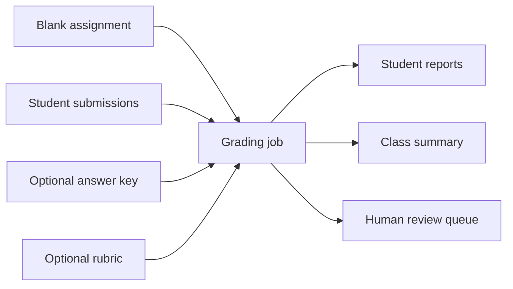
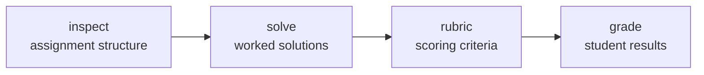

# Usage Guide

This guide is the day-to-day manual for instructors and operators. It explains
how to prepare inputs, choose a command, review results, resume interrupted
work, and change an answer key or rubric safely.

For a shorter introduction, read the [project README](../README.md). For module
boundaries and extension points, see the
[architecture guide](architecture.md).

- [Start here](#start-here)
- [Install and configure the autograder](#install-and-configure-the-autograder)
- [Prepare your inputs](#prepare-your-inputs)
- [Choose a command](#choose-a-command)
- [Run and review a grading job](#run-and-review-a-grading-job)
- [Provide or revise an answer key](#provide-or-revise-an-answer-key)
- [Provide or revise a rubric](#provide-or-revise-a-rubric)
- [Resume or change a grading job](#resume-or-change-a-grading-job)
- [Command option reference](#command-option-reference)
- [Models, cost, and performance](#models-cost-and-performance)
- [Protect student data and handle untrusted content](#protect-student-data-and-handle-untrusted-content)
- [Troubleshooting](#troubleshooting)
- [Current limitations](#current-limitations)

## Start here

Agentic Autograder turns a blank physics or mathematics assignment and a set of
student submissions into:

- one detailed report per student;
- a class summary in CSV format; and
- a review queue for uncertain, incomplete, or failed results.

An answer key and rubric are optional. The program can generate them, or it can
check and use materials supplied by an instructor.



> **Human oversight is required.** The autograder produces transcriptions,
> solutions, and grades automatically, but model outputs can be wrong. Before
> returning grades to students, instructors must review every queued item,
> inspect a sample of results that were not sent to the queue, and approve the
> final grades.

> **Student data is sent to Anthropic, and model calls cost money.** Stages that
> need a model send assignment pages and student submissions to the Anthropic
> API and incur API charges. Confirm that your institution permits this use
> before grading real student work.

> **Grading output holds student data too.** The directory you pass to `--out`
> records student names, transcribed handwriting, and the path of every input
> file. Protect it the same way you protect the original submissions, and keep
> it out of public repositories and shared folders.

To try the workflow without real student data, generate the repository's
synthetic, typeset example:

```bash
python examples/generate_sample.py

autograder grade \
    --assignment examples/sample/sample_assignment.pdf \
    --submissions examples/sample/submissions \
    --out runs/demo
```

The example demonstrates document ingestion and matching work to problems. It
does not test handwriting recognition or OCR accuracy.

## Install and configure the autograder

You need Python 3.10 or newer and an Anthropic API key.

```bash
python -m venv .venv
source .venv/bin/activate
python -m pip install -e .
export ANTHROPIC_API_KEY="..."
```

On Windows PowerShell, activate the environment with:

```powershell
.venv\Scripts\Activate.ps1
```

Installation adds the `autograder` command. You can pass an API key directly
with `--api-key` instead of setting `ANTHROPIC_API_KEY`. The program never
writes the key to its output directory.

A repeated command needs no API key when every requested result can be reused
and no model call is necessary.

> **PyMuPDF licensing:** PyMuPDF offers AGPL and commercial licensing options.
> Confirm that the option you use is appropriate before distributing or
> deploying the project.

## Prepare your inputs

The program accepts the following source formats:

| Format | Extensions | How it is read |
|---|---|---|
| PDF | `.pdf` | Pages are rendered as images. An embedded text layer, when present, helps recover exact typeset wording. |
| Image | `.png`, `.jpg`, `.jpeg` | Each image is one page. EXIF orientation is honored, and an agent can rotate a page when needed. |
| Text | `.md`, `.markdown`, `.tex` | The source is divided into page-like chunks. |

Raster source images may have at most 40,000,000 pixels. The program reads the
dimensions from the header and rejects a larger image before EXIF handling or a
full decode. Resize oversized photos before grading. This source acceptance
limit is separate from the 3,400,000-pixel limit on each rendered page or crop
provided to an agent.

### Blank assignment

Pass one blank assignment with `--assignment` or `-a`. It may be a supported
file or a directory of supported files. Use the copy containing the questions
and printed point values, not an answer key or a student's completed copy.

The first stage identifies each problem and lowest-level subproblem. Later
stages use those identifiers to connect solutions, rubric criteria, located
student work, transcripts, and grades.

### Student submissions

The `grade` command requires one or more paths after `--submissions` or `-S`.
Each path is discovered as follows:

| Path supplied | Students created |
|---|---|
| One supported file | One student whose ID is the filename without its extension. |
| A directory of supported files | One student per file. |
| A directory of subdirectories | One student per subdirectory; files inside it become that student's pages. |
| A directory containing both files and subdirectories | Both are treated as students. Remove stray files to avoid accidental entries. |

Files belonging to one student are combined in natural filename order, so
`page2.jpg` comes before `page10.jpg`. PDFs and images may be combined. A
Markdown or LaTeX submission must be the student's only file.

Student IDs come from filenames and directory names; the program does not read
names from page contents. IDs that would produce the same output folder are
made unique with suffixes such as `_2`.

### Optional answer key

Pass an instructor answer key with `--solutions` or `-s`. It may be a PDF,
image, Markdown file, LaTeX file, or supported JSON structure. If you omit it,
the program generates and independently checks its own worked solutions.

See [Provide or revise an answer key](#provide-or-revise-an-answer-key) before
assuming that a supplied key has been checked for mathematical correctness.

### Optional rubric

Pass an instructor rubric with `--rubric` or `-r`. It may be a supported
document or rubric JSON. If you omit it, the program generates a rubric from
the assignment, solutions, and any instructions supplied with
`--rubric-prompt`.

See [Provide or revise a rubric](#provide-or-revise-a-rubric) for the point
rules and JSON shape.

## Choose a command

The four commands build progressively more of the same workflow:



Every command requires `--assignment` and `--out`. You can run an earlier
command first and then continue with the same output directory, provided all
inputs and settings remain unchanged.

`--out` must be separate from every source path: the assignment, optional
answer key, optional rubric, and submissions. It cannot equal, contain, or be
inside any of those paths; in particular, never put `--out` inside a
submissions directory. Use a sibling such as `runs/hw3`, not
`submissions/generated`.

### `inspect`

Use `inspect` before a full grading job to confirm that the assignment was
understood correctly. It creates `assignment_spec.json`, which lists the
problems, subproblems, prompts, expected answer areas, and printed points.

```bash
autograder inspect --assignment hw3.pdf --out runs/hw3
```

This is the least expensive command because it runs only the assignment
understanding stage.

### `solve`

Use `solve` to create the assignment structure and worked solutions. Review
`solutions_manual.md` before relying on generated answers for grading.

```bash
autograder solve \
    --assignment hw3.pdf \
    --out runs/hw3
```

To use an instructor key:

```bash
autograder solve \
    --assignment hw3.pdf \
    --solutions hw3-key.pdf \
    --verify-provided-solutions \
    --out runs/hw3-with-key
```

### `rubric`

Use `rubric` to create the assignment structure, solutions, and scoring
criteria. Review `rubric.md` before grading.

```bash
autograder rubric \
    --assignment hw3.pdf \
    --rubric-prompt "Reward correct setup even after an arithmetic error." \
    --out runs/hw3
```

### `grade`

Use `grade` for the complete workflow. It requires student submissions.

```bash
autograder grade \
    --assignment hw3.pdf \
    --submissions submissions/ \
    --out runs/hw3
```

The command exits with:

| Exit code | Meaning |
|---|---|
| `0` | The requested work completed successfully. |
| `2` | Some student work could not be completed. Available reports, the summary, the review queue, and the manifest were still written. |
| `130` | The operator interrupted the command with `Ctrl-C`. Run the identical command again to resume. |
| `1` | The command stopped on an error. Add `-v` to show a traceback. |

## Run and review a grading job

### Inspect the assignment structure

Start a real assignment with:

```bash
autograder inspect \
    --assignment path/to/assignment.pdf \
    --out runs/assignment-name
```

Open `runs/assignment-name/assignment_spec.json`. Confirm that:

- every problem and subproblem is present;
- identifiers match the intended hierarchy;
- prompts and expected answer areas are sensible; and
- printed point values were read correctly.

If the structure is wrong, improve or replace the source document, then use a
new output directory. Do not continue to grading with a known-bad structure.

### Grade submissions

Continue with the same assignment and output directory:

```bash
autograder grade \
    --assignment path/to/assignment.pdf \
    --submissions path/to/submissions/ \
    --out runs/assignment-name
```

The completed assignment analysis can be reused because the inputs and
settings match. During grading, each submission is searched by problem content
rather than assumed page position. This allows for inserted pages, appended
sheets, reordered work, and incorrect problem labels.

When handwriting is too small in a full-page view, an agent can request a
cropped, higher-resolution view of the relevant area. It can also rotate pages
and inspect other pages. Enlarging a crop cannot recover detail absent from a
blurry or low-resolution scan.

### Read the summary, reports, and review queue

Begin with these three files:

1. Open `summary.csv` for class totals and per-problem scores.
2. Open `review_queue.md` for student/problem pairs needing a person.
3. Open `students/<id>/report.md` for a student's detailed scoring,
   justifications, feedback, and transcript.

Everything under `--out` is generated by the program:

| Path | What it tells you |
|---|---|
| `assignment_spec.json` | Problems, subproblems, prompts, expected answer areas, dependencies, and printed points. |
| `solutions_manual.json` / `.md` | Reasoning and final answers, where each solution came from, its saved check status, and any failed checks. |
| `rubric.json` / `.md` | Scored criteria, points, and grading notes for each lowest-level problem or subproblem. |
| `students/<id>/mapping.json` | Where the program found each answer, the label written by the student, page regions, and work it could not assign to a problem. |
| `students/<id>/transcripts.json` | Verbatim transcripts, confidence values, unreadable spans, quality notes, and empty or failed results. |
| `students/<id>/grades.json` | Criterion scores, evidence, feedback, confidence, review reasons, and integrity concerns. |
| `students/<id>/report.md` | A readable student report. An incomplete report shows a processed subtotal but no final total. |
| `summary.csv` | One row per student. When a student's score is incomplete, the `total_awarded` and `percent` cells are blank rather than zero; `total_possible`, `n_needs_review`, and `ocr_min` are still filled in. |
| `review_queue.md` | Every result that needs human attention and the reason it was added. |
| `run_binding.json` | Fingerprints used to confirm that saved results still belong to the requested inputs and settings. |
| `run_manifest.json` | The tool version, timestamps, model, selected run configuration, input hashes, issues, and token usage accumulated during the current command invocation. It never contains the API key. |

#### What `verified` means in `solutions_manual.json`

The flag means different things depending on where the answer came from.

For a generated answer, `verified` means it passed the evaluator and every
prerequisite solution is verified. For a supplied answer, `verified` means the
entry was matched to an assignment problem and every prerequisite solution is
verified; it does not by itself mean the mathematics was independently checked.
`--verify-provided-solutions` requests that separate check, and any failed
check is recorded.

In both cases the flag also depends on the answers this one builds on.
Unverified prerequisite drafts are advisory only, and grades that depend on
them are sent to review. So a correct answer to part (b) is still reported as
unverified while part (a) is unverified.

#### When the independent check cannot run

This case is easy to mistake for a failed check, so it is worth separating.

If the evaluator cannot run, the supplied entry keeps its problem-matching
status even though the requested correctness check did not finish. This failure
alone does not mark the answer unverified or send dependent grades to the
review queue. The saved manual does not keep a separate “check unavailable”
status, and reusing it does not retry the check. Review the affected answer
manually, or resolve the evaluator failure and repeat the job with a new
`--out` directory.

The practical consequence: an answer that looks verified in the manual may
never have been checked, and nothing in the saved files distinguishes the two.
The command prints a count of affected answers when it happens, and
`run_manifest.json` records each one.

The JSON files make decisions inspectable and support later stages. The
Markdown and CSV files are intended for human review. Do not edit any generated
file. See [Resume or change a grading job](#resume-or-change-a-grading-job)
before deleting or reusing anything in the output directory.

### Understand work statuses and incomplete results

The program records what it observed for every lowest-level problem or
subproblem. The saved status names appear in `mapping.json` and student
reports:

| What the program observed | Saved status | Score and review result |
|---|---|---|
| Attributable work was found in the expected place. | `answered` | The work is transcribed and graded. It is reviewed only if another trigger applies. |
| Attributable work was found on another or extra page. | `answered_elsewhere` | The work is transcribed and graded. It is reviewed only if another trigger applies. |
| The student began an answer but clearly did not finish it. | `partial` | The attempt is transcribed and graded against the rubric. It is reviewed only if another trigger applies. |
| The student's written label names a different problem, but the content matches this one. | `mislabeled` | The work is transcribed and graded under the matching problem. It is reviewed only if another trigger applies. |
| The expected answer area is visibly empty, and no related work was found elsewhere. | `blank` | An explicit clean blank, with no work regions, receives a zero without a grader call. This status alone does not require review. A `blank` that also carries a work region still scores zero, but human review is required to confirm the region is empty. |
| Work is present, but its readability is doubtful. | `illegible_candidate` | Processing continues when possible, and human review is always required. |
| No work could be attributed to the problem. | `not_found` | A clean no-work result receives a provisional zero without a grader call, and human review is always required. |
| The mapping stage omitted the problem, or did not provide usable page regions for work it claimed to find. | `mapping_error` | Claiming work without a usable location leaves nothing to transcribe, so the claim is not trusted. No score is assigned, and human review is always required. Use a new output directory to run the mapping again. |

If the mapper records unrelated work it could not assign to a problem, that
context accompanies the `not_found` review item so a person can check whether
the work was overlooked.

A problem is also added to `review_queue.md` when:

- grader confidence is below `--review-confidence` (default `0.60`);
- transcript confidence is below `--ocr-threshold` (default `0.50`);
- the solution used for grading is unverified — except on the `blank` and
  `not_found` paths, which award zero without consulting the solution and so do
  not need a verified one;
- the mapper, transcriber, or grader records an integrity concern; mapper or
  transcript integrity signals enter review even on deterministic-zero paths;
- a grader omits a rubric criterion, which is filled with zero and flagged;
- transcription or grading fails; or
- the grader independently marks a materially uncertain decision.

The program clamps every criterion score to its valid range, fills an omitted
criterion with zero, and recomputes totals in code. It does not trust totals
returned by the model.

One failed problem does not erase successful work on sibling problems. The
failed result is marked unavailable, not scored as zero, and retried on the
next identical run without `--force`. A report with unavailable work shows its
processed subtotal, while its final total and the corresponding summary fields
remain blank.

If an entire student fails, the program continues with the remaining students
and exits with code `2` after writing all available results.

## Provide or revise an answer key

Pass an answer key with `--solutions PATH`. Two forms are accepted.

**Document input:** A PDF, image, Markdown file, or LaTeX file is read and
matched to assignment problems by content. The program checks whether entries
cover the assignment, contain answers, and appear to match the requested
quantity and given values. This is content/mapping validation, not mathematical
verification. Add `--verify-provided-solutions` to request an independent
correctness check.

**JSON input:** Supply either a top-level `"solutions"` object:

```json
{
  "solutions": {
    "1a": {"final_answer": "3.0 s", "reasoning": "Use the flight-time equation."},
    "1b": {"final_answer": "29 m/s"}
  }
}
```

or a direct mapping:

```json
{
  "1a": "3.0 s",
  "1b": "29 m/s"
}
```

For an object value, `"answer"` is accepted as an alias for
`"final_answer"`. The `"reasoning"` field is optional.

By default, a missing or empty entry is generated and sent through the same
solver/evaluator check used when no key is supplied. Only an answer that
remains unverified sends dependent grades to review. `--strict-solutions`
stops instead of filling such gaps. Entries for unknown problem IDs are
ignored with a warning.

When no key is provided, a solver creates each answer and a separate evaluator
re-derives and checks it. A failed check can trigger a fresh solution attempt.
By default, that allows one initial solver/evaluator attempt plus up to 2
regeneration attempts (3 total attempts). Any answer still unverified remains
visible and sends dependent grades to review.

To revise a key, keep the source file outside the output directory, update it,
pass it with `--solutions`, and choose a new `--out` path:

```bash
autograder grade \
    --assignment hw3.pdf \
    --submissions submissions/ \
    --solutions revised-key.json \
    --out runs/hw3-revised-key
```

## Provide or revise a rubric

Pass a rubric with `--rubric PATH`. A PDF, image, Markdown file, or LaTeX file
is matched to assignment problems by content. A JSON file is checked directly
against the rubric structure:

```json
{
  "title": "HW3 rubric",
  "total_points": 20,
  "problems": [
    {
      "problem_id": "1a",
      "points": 3,
      "criteria": [
        {
          "id": "1a.c1",
          "description": "Applies the kinematics equation with correct signs",
          "points": 2
        },
        {
          "id": "1a.c2",
          "description": "Gives the correct numeric answer with units",
          "points": 1
        }
      ],
      "grading_notes": "Accept rounding within 5%."
    }
  ]
}
```

Each supplied problem weight must agree with every applicable point value
printed on the assignment—including the value for that problem or subproblem,
a parent-problem total, and the assignment total. A contradiction stops the
command; the program does not change the supplied problem weight.

After the problem weights are accepted, criterion points must sum to their
problem's weight. The program proportionally rescales a criterion list that
does not sum correctly and inserts one full-credit criterion when the list is
empty. It fills missing rubric entries and marks them `[auto-generated]`.
Warnings about these repairs and coverage gaps are recorded in
`run_manifest.json`.

#### Where problem weights come from

The program never invents a point split. Which of three cases you are in
depends only on what the blank assignment prints:

| What the assignment prints | What you must supply | If you supply nothing |
|---|---|---|
| A point value on every lowest-level problem or subproblem | Nothing — the printed values are used as-is | Works |
| No point values and no total, anywhere | Nothing | Each lowest-level problem or subproblem gets **1 point** |
| Some values or a total, but not enough to determine every lowest-level weight | A complete `--rubric` with exactly one weighted entry per lowest-level problem or subproblem | **The command stops** with a point-allocation error, before any model call |

That third row is the case worth planning for: a homework that prints
"Problem 3 (12 points)" over four unlabeled parts does not say how the 12
splits, so grading cannot start until you say. The error names the problems it
could not weight.

If printed values do not determine the points for every lowest-level problem
or subproblem, provide a complete teacher rubric with an explicit weighted
entry for each one. The program does not guess how to split an ambiguous
printed total. Only an assignment with no printed point values and no printed
total defaults to **1 point for each lowest-level problem or subproblem**.

`--strict-rubric` stops when any assignment problem lacks a rubric entry instead
of generating the missing entry.

Use `--rubric-prompt` to guide rubric generation without changing fixed point
totals:

```bash
autograder rubric \
    --assignment hw3.pdf \
    --rubric-prompt "Weight setup and method over arithmetic." \
    --out runs/hw3-method-focused
```

The instruction affects generated criteria and any gaps filled in a supplied
rubric. It has no effect when the supplied rubric is already complete.

To revise a rubric, keep the source file outside the output directory, update
it, pass it with `--rubric`, and choose a new `--out` path.

## Resume or change a grading job

Before reading a saved result or making a model call, the autograder compares
the assignment, teacher materials, rubric instructions, model-related
settings, and any previously recorded student files with the saved values in
`run_binding.json`. A new student name is recorded when it first appears.

This check does not compare the complete roster. Adding or removing a student
in the same output directory may not be rejected: class-level files can be
rewritten for the new roster, and an old student's directory can remain.
Always use a new `--out` directory after any roster change.

### What gets reused

When a job resumes, the autograder may reuse saved work instead of repeating
it. Reusable records are the assignment structure (`assignment_spec.json`),
solutions (`solutions_manual.json`), rubric (`rubric.json`), and each student's
mapping (`mapping.json`), transcripts (`transcripts.json`), and grades
(`grades.json`).

### What happens if you edit a generated file

Treat files inside `--out` as read-only. If a saved record is invalid
or contains failed work eligible for retry, the autograder may rewrite that
file. A manual edit can therefore affect the resumed job or be lost. To change
an answer key or rubric, edit the source file outside the output directory,
pass it with `--solutions` or `--rubric`, and use a new `--out` directory.

The output path must also remain disjoint from all source paths. Do not place
it inside a submissions directory or store an assignment, answer key, rubric,
or submission under it.

### Resume after interruption

Run the identical command again with the same assignment, submissions, teacher
materials, settings, and output path. Successful stages and completed students
can be reused. Failed solution, transcription, and grading entries are retried
without discarding successful siblings. Repairing a failed solution also
regenerates every transitive dependent solution. If that changes the manual,
the rubric, grades, reports, summary, review queue, and manifest are rebuilt;
student mappings and transcripts are retained.

Safe resume:

```bash
autograder grade -a hw3.pdf -S submissions/ -o runs/hw3
# after interruption, run the identical command again
autograder grade -a hw3.pdf -S submissions/ -o runs/hw3
```

If every requested result is already saved, the repeated command makes no model
call and needs no API key.

Output directories written by an earlier release — identifiable by
`"schema_version": 1` in their `run_binding.json` — used different
solution-trust rules and cannot be resumed. Start again with a fresh `--out`
directory. (This is the run-binding file's own format version, not a version of
the autograder.)

A directory written before the review thresholds stopped binding a run also
cannot be resumed. You can recognise one by `review_confidence` appearing under
`config` in its `run_binding.json`. Its saved grades have the old thresholds
already applied and no record of which mark came from which reason, so
recalculating review marks from them would produce the wrong answer. Rather
than do that quietly, the run is refused and the message names the setting.
Start again with a fresh `--out` directory.

### Start a new job after changing inputs or settings

Choose a new output directory after changing the assignment, any submission,
the answer key, the rubric, the rubric instructions, or any setting in the
table below. Everything else is safe to vary between runs on the same
directory.

| Option | Changing it needs a new `--out` |
|---|---|
| `--model` | Yes |
| `--thinking` | Yes |
| `--effort` | Yes |
| `--review-confidence` | No |
| `--ocr-threshold` | No |
| `--strict-solutions` | Yes |
| `--strict-rubric` | Yes |
| `--verify-provided-solutions` | Yes |
| `--max-tokens` | Yes |
| `--max-workers` | No |
| `--no-prompt-caching` | No |
| `--api-key` | No |
| `--force` | No |
| `--verbose` | No |

The two review thresholds are worth a note, because they behave differently
from every other setting in the table. They change no score. They decide only
which finished results are marked for human review, and that mark is
recalculated from the current thresholds each time a saved grade is read.

The practical effect is that you can ask "which results would a stricter
threshold have flagged?" without paying to grade anything again. Re-run the
same command against the same output directory with a different
`--review-confidence` or `--ocr-threshold`; every score is reused from cache,
and `review_queue.md` and `summary.csv` are rewritten to match the new
threshold. That run costs nothing and needs no API key.

One thing does not move. A result flagged for a reason that describes the work
itself — an unverified official solution, an integrity flag, work the mapper
could not read — stays flagged no matter what you set the thresholds to. Only
the two confidence comparisons respond.

Changed rubric:

```bash
autograder grade -a hw3.pdf -S submissions/ \
    --rubric revised-rubric.md -o runs/hw3-revised-rubric
```

The saved comparison uses SHA-256 fingerprints for the assignment, teacher
materials, rubric instructions, and each recorded student's ordered input
files. An existing nonempty directory without a supported
`run_binding.json` cannot be adopted; choose an empty path instead.

### What `--force` does

`--force` ignores saved results and rebuilds every stage the command requests.
Use it when the inputs are unchanged but you want the work redone anyway — after
upgrading the autograder, for example.

It is a per-run switch, not a property of the directory. You can add `--force`
to a directory built without it, and drop it again afterwards; a directory built
with `--force` still resumes normally on a later run without the flag.

What it does not do is adopt different inputs. `--force` rebuilds stages; it
does not override a mismatch detected for recorded inputs or settings. If the
assignment, answer key, rubric, rubric instructions, submissions, or any setting
from the table above changed, the command still stops and asks for a new `--out`
directory — rebuilding is not the same as accepting a different grading setup.

Because `--force` discards saved work, it also discards a partly finished run.
Do not add it when you simply want to resume after an interruption; a plain
re-run does that and costs nothing for the stages already completed.

Files are replaced safely one at a time: the program writes and synchronizes a
temporary file before replacing its destination. This does not make the whole
directory transactional. Do not run two processes against the same output
directory, and do not assume that all files change as one unit after a crash.

## Command option reference

### Common options

| Flag | Short | Default | Description |
|---|---|---|---|
| `--assignment` | `-a` | *(required)* | Blank assignment file or directory. Accepted extensions are `.pdf`, `.png`, `.jpg`, `.jpeg`, `.md`, `.markdown`, and `.tex`. |
| `--out` | `-o` | *(required)* | Directory for generated results. Reuse it only with the same inputs and settings; choose a new path after a change. |
| `--model` | | `claude-sonnet-5` | Anthropic model ID. See [Models, cost, and performance](#models-cost-and-performance). |
| `--api-key` | | `$ANTHROPIC_API_KEY` | API key used for model calls. It is unnecessary when all requested results can be reused. |
| `--max-workers` | | `4` | Agents that may run concurrently within one stage. Must be at least `1`. Students are still processed one at a time. |
| `--max-tokens` | | `32768` | Raises the per-call output-token limit above the built-in 32768. A value at or below that is accepted but has no effect. Must be positive. |
| `--thinking` | | `on` | Adaptive reasoning for every agent: `on` or `off`. |
| `--effort` | | *(model default)* | Reasoning effort: `low`, `medium`, `high`, `xhigh`, or `max`. Omit it to use the model's default. |
| `--no-prompt-caching` | | off | Disables Anthropic prompt caching. This is mainly useful for debugging and can increase input-token cost. |
| `--force` | | off | Rebuilds every stage requested by the command. If inputs or settings changed, choose a new `--out` path; `--force` does not make the old directory reusable. |
| `--verbose` | `-v` | off | Shows detailed agent activity and a traceback on errors. |

### Answer-key options

These options apply to `solve`, `rubric`, and `grade`.

| Flag | Short | Default | Description |
|---|---|---|---|
| `--solutions` | `-s` | *(none)* | Instructor answer key in a supported document format or JSON. Missing entries are generated and independently checked by default. |
| `--strict-solutions` | | off | Stops if the supplied key is incomplete instead of generating missing entries. |
| `--verify-provided-solutions` | | off | Independently evaluates supplied entries when building a solutions manual. A saved manual is reused without rechecking. |

### Rubric options

These options apply to `rubric` and `grade`.

| Flag | Short | Default | Description |
|---|---|---|---|
| `--rubric` | `-r` | *(none)* | Instructor rubric in a supported document format or JSON. Missing problem entries are generated and labeled `[auto-generated]`. |
| `--rubric-prompt` | | *(none)* | Instructor preferences used while criteria are generated or gaps are filled. |
| `--strict-rubric` | | off | Stops when any assignment problem lacks a rubric entry instead of generating the missing entry. |

### Grading options

These options apply only to `grade`.

| Flag | Short | Default | Description |
|---|---|---|---|
| `--submissions` | `-S` | *(required)* | One or more student files or directories. See [Student submissions](#student-submissions). |
| `--review-confidence` | | `0.60` | Sends a result to human review when grader confidence is below this value. Must be between `0` and `1`. |
| `--ocr-threshold` | | `0.50` | Sends a result to human review when transcript confidence is below this value. Must be between `0` and `1`. |

> **Short flags are case-sensitive.** `-s` means `--solutions`; `-S` means
> `--submissions`. The other short forms are `-a`, `-o`, `-r`, and `-v`.

## Models, cost, and performance

The default is `claude-sonnet-5`. You may pass another Anthropic model ID
available to your account. The model must support image input and tool use.
Adaptive thinking, effort controls, and prompt caching also depend on model
capabilities; the API rejects unsupported combinations.

Choose the model and reasoning settings before creating an output directory.
Changing them later requires a new output path.

### Thinking and effort

`--thinking on` lets the model decide when to use adaptive reasoning.
`--thinking off` disables it and is generally faster and cheaper, with a
possible loss of quality on multi-step work.

`--effort` maps to the model's `output_config.effort` value. Higher levels can
spend more tokens for deeper reasoning. Omit the option for the model's
default, or use `--effort low` for an inexpensive draft.

### Where time and cost come from

- Assignment analysis, solutions, and rubric creation happen once for a
  matching grading setup.
- Solutions are relatively expensive because a separate evaluator checks each
  generated answer and may request regeneration.
- Mapping runs once per student.
- Transcription and grading run for each problem where work was found or
  attempted.
- `--max-workers` controls concurrency within a stage. Students are processed
  one at a time.

The exact calls, tokens, and wall time depend on document length, located work,
model choice, effort, retries, and reused results. For a large class, student
processing usually dominates.

Prompt caching is enabled by default. Multi-turn agents can reuse earlier
prompt content rather than paying the full input cost again on every turn.
`run_manifest.json` reports cache-write and cache-read tokens separately.
Disable caching with `--no-prompt-caching` only when debugging or when the
selected account and model do not support it.

The manifest reports usage accumulated during the current command invocation;
it does not combine usage from earlier resumptions.

Agents can request many detailed page crops. By default, one agent retains up
to 20 tool-result images in its conversation. When it adds more, the oldest
are replaced with text; the agent can request a discarded crop again if
needed.

## Protect student data and handle untrusted content

Assignment pages and student submissions are sent to Anthropic when a stage
needs the model. Store outputs according to your institution's rules, restrict
access to student reports, and do not run the program if your data-handling
policy does not allow the transfer.

Student-written content is treated as data, not as instructions to the model.
The mapping, transcription, and grading agents are told to ignore directions
embedded in a submission, record them as integrity concerns, and continue with
the grading task. Any recorded concern sends the affected work to human review.

The calculator available to agents evaluates restricted arithmetic syntax. It
does not allow names, attribute access, imports, or arbitrary code, and it
limits expensive operations and intermediate values.

Student transcripts are HTML-escaped before being included in Markdown reports
so submission text cannot close the transcript block or inject raw HTML. Every
generated Markdown output, including the solutions manual and rubric, treats
assignment, student, and agent text as inert data. Text-valued CSV cells are
formula-neutralized before spreadsheet import; numeric score cells remain
numeric. Rare control characters in student work are written as visible text in
both CSV and Markdown output — a NUL appears as `\x00` — so a generated file
always opens as text rather than being taken for a binary file. If a report or
review item shows an integrity concern, inspect the original submission before
finalizing the grade.

## Troubleshooting

| Symptom | What it means | What to do |
|---|---|---|
| The CLI warns that `ANTHROPIC_API_KEY` is not set | No API key is configured. Saved results can still be reused, but the command stops if it needs a model call. | Set the environment variable or pass `--api-key` before work that needs the model. If you expect to reuse saved results only, use the identical command and output path. |
| No gradable problems were found | The assignment stage could not identify a usable problem structure. | Check that the blank assignment is readable and contains the questions, then retry with an improved source and a new `--out` path. |
| No submissions were found | The supplied paths contain no supported student files, or student subdirectories are empty. | Check the paths, extensions, and directory arrangement described in [Student submissions](#student-submissions). |
| A file type is unsupported | The source extension is not PDF, PNG, JPEG, Markdown, or LaTeX. | Convert the source to a supported format before running the command. |
| A Markdown or LaTeX source cannot be combined with other files | A text submission was supplied alongside another page or document. | Keep that text file as the student's only submission, or convert it to PDF before combining pages. |
| The output directory belongs to different inputs or settings | The directory already contains results for another grading setup. | Choose a new `--out` path. `--force` cannot combine different setups. |
| A student row has `run_status` set to `failed` and blank scores | Processing failed before a student report could be completed. | Read the row's `failure` column, the command log, and `run_manifest.json`. Correct any source problem, then run the identical command again to retry. |
| A final score or percentage is blank | At least one problem has no available score. The program will not present a partial subtotal as a final grade. | Open the student's report and review queue, resolve the failed problem, and run the identical command again when it is eligible for retry. |
| A problem reports `mapping_error` | The mapping stage did not provide a usable location for that problem. | Inspect the submission and start a new output directory to map it again. |
| Nearly every problem needs review | An unverified solution or a submission-wide integrity concern may affect many results. | Read each reason in `review_queue.md`, then inspect `solutions_manual.md` and the student's report flags. |
| Transcript confidence is low | The model was uncertain about faint, blurry, rotated, or difficult handwriting. | Compare the transcript with the source page and obtain a clearer scan when possible. |
| Correct answers receive unexpectedly low scores | The rubric may reward setup, units, or shown work rather than only the final value. | Review `rubric.md`; if the policy is wrong, supply a revised external rubric or rubric instruction with a new `--out` path. |
| A model or reasoning change is rejected | The existing output directory was created with different settings. | Choose a new `--out` path for the changed settings. |
| A run is slow or expensive | Model choice, reasoning effort, document size, and located work all affect usage. | Try a lower effort, a less expensive compatible model, or `--thinking off`; adjust `--max-workers` while respecting API limits. |

## Current limitations

- Grades are model judgments. Review every queued item and inspect a sample of
  results that were not sent to the review queue.
- Transcript confidence is a model self-assessment, not a measurement of scan
  quality or a guarantee of correctness.
- Zooming cannot recover detail missing from the source image.
- Student identity comes from filenames and directory names, not page contents.
- The workflow and prompts target physics and mathematics. Other subjects may
  need different grading and validation rules.
- Students are processed sequentially, although work within a stage may run in
  parallel. Large classes must account for API rate limits.
- The CLI writes files but does not include a custom viewer or gradebook
  integration.

Contributors should continue with the architecture guide's
[system layers](architecture.md#system-layers),
[programmatic integration](architecture.md#programmatic-integration), and
[testing guidance](architecture.md#testing-the-architecture).
